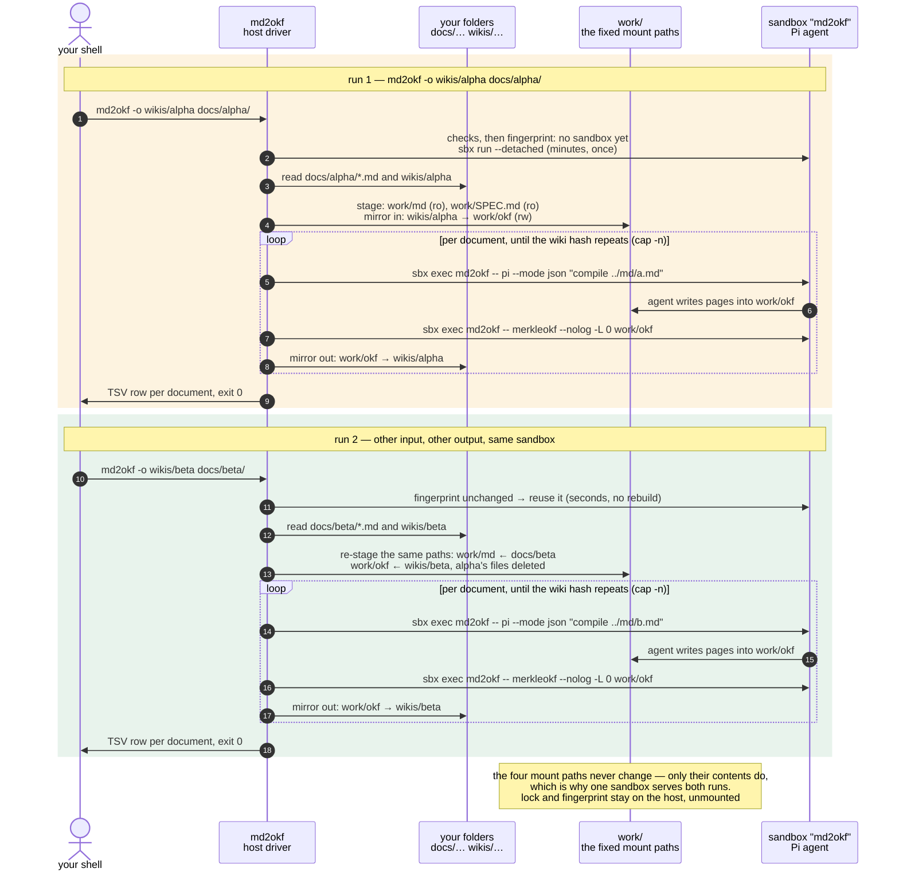
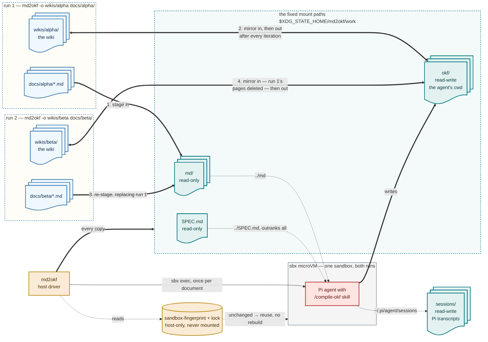

<!-- cspell:words argparse workbench uvx pipx hatchling sdist GHCR importlib flock progfile DEVNULL Popen SBXAGENT nullglob pipefail shopt pypi mountpoint EROFS submounts virtiofs -->

# Plan: ship `md2okf` as a packaged primitive

## Context

Today the wiki is compiled by `make wiki`, which runs
`scripts/compile-okf.sh`, plus three sibling launchers (`scripts/bash.sh`,
`scripts/pi.sh`, `tests/test-sandbox.sh`) that each repeat the same sandbox
dance. That arrangement has six concrete defects:

- **Nothing in the driver is tested.** The Ralph loop, the prompt construction
  and the event rendering (`scripts/compile-okf.sh:89-130`) are reachable only
  through a live, paid, minutes-long sandbox run. Only mount selection and the
  guest-side state helper have host tests.
- **The launchers disagree.** `scripts/bash.sh:31-36` and
  `scripts/pi.sh:31-36` are the same eleven lines, reusing the sandbox via
  `sbx ls -q | grep -qx`; `scripts/compile-okf.sh:53` unconditionally runs
  `sbx rm --force`. Rebuild-versus-reuse is a property of which script you
  happened to run, not a flag.
- **Arguments are split between two entry points.** The source folder reaches
  only the script, the iteration cap only the environment (`RALPH_MAX`).
  Neither can compile a single document or show what would run.
- **The options are undiscoverable** — `RALPH_MAX`, the folder positional,
  `XDG_STATE_HOME` and `.env` live in script comments and README prose.
- **Host requirements serve the driver, not the user.** `jq` exists solely for
  the event filter at `scripts/compile-okf.sh:89-100`; `make` exists solely to
  reach the script.
- **It only works inside this checkout.** The tool cannot be pointed at someone
  else's folder, which is the thing it should be able to do.

The goal is a primitive in the `grep`/`awk` sense: one command, files in, a
directory out, flags for the few knobs, exit codes that mean something, no
subcommands, no project root, nothing to `cd` into — installed from PyPI with
the kit and the OKF spec inside the package, so it runs against any folder on
any machine that has `sbx`. Then it composes: pipelines
(`web2md … | md2okf -o okf/`), loops (`for f in …; do md2okf -o "wikis/$n" "$f"; done`),
other people's Makefiles, CI.

## The command

```text
md2okf [-o DIR] [--spec FILE] [-n N] [--fresh] [--dry-run] [-q | -v] [FILE|DIR ...]
md2okf --version | --help
```

| | `grep` / `awk` | `md2okf` |
| --- | --- | --- |
| program | the pattern; `awk -f progfile` | fixed (the `compile-okf` skill). `--spec FILE` swaps the OKF spec, awk's `-f`; default is the bundled `SPEC.md` |
| inputs | files; `-` or none means stdin | Markdown files, in the order given; a DIR means its `*.md`, sorted, non-recursive; `-` or no argument means stdin (refused on a TTY with usage, exit 2 — a paid, minutes-long run should not start on an idle terminal) |
| output | stdout | the wiki in `-o DIR` (default `./okf`, created if missing). stdout carries one TSV line per document: `path  iterations  hash-before  hash-after` |
| diagnostics | stderr | the `Compiling … (iteration n)` and `hash -> hash` lines. `-v` adds Pi's tool calls and prose (today's `jq` view); `-q` prints nothing |
| exit status | 0 / 1 / 2 | 0 every document converged; 1 a document hit the iteration cap, or an iteration produced no writes — partial work is on disk and named on stderr; 2 usage or environment (`sbx` missing or < 0.43, not logged in, key not proxy-managed, no documents, another run holds the sandbox) |
| state | none | one long-lived sandbox named `md2okf` (the name the `sbx secret` workaround is keyed to). Built on first use, reused after, rebuilt when the bundled kit changes or the mount set differs, and on `--fresh` |

**Not in the surface:** `compile`, `shell`, `pi`, `sandbox up/down/status`,
`doctor`, `lint`/`check`. Those are repository chores, not the tool's job.
`sbx exec -it md2okf -- bash` and `-- pi` are one-liners once a sandbox exists
and belong in `CONTRIBUTING.md`. The environment checks run on *every*
invocation and fail with the fix in the message, which is what `doctor` would
have been for — a check that only runs when asked prevents nothing. The wiki
gate stays `make check-okf`, which runs
`kits/md2okf/files/home/.pi/agent/skills/compile-okf/scripts/check-okf.sh`
(`okfctl` plus the frontmatter guard); putting it in the CLI would make
`okfctl` a requirement of a command that does not need it.

`RALPH_MAX` becomes `-n`. `.env` goes: a tool not tied to a checkout has no
repository to read a `.env` from, so `XDG_STATE_HOME` is the one knob, with
`~/.local/state` as the default.

## Constraints that must hold

- **The sibling layout.** The kit's shims resolve the helper CLIs from
  `$(dirname "${WORKDIR}")/scripts/<cli>` (`kits/md2okf/spec.yaml:281-312`),
  and `../md/` and `../SPEC.md` are woven through the agent config
  (`kits/md2okf/files/home/.pi/agent/AGENTS.md:38-59`, the `compile-okf` and
  `inspect-md` skills). Breaking it costs an agent-prose migration, which is
  the expensive kind of change.
- **The driver is not the agent's business.** It runs on the host and must not
  live under a directory mounted into the VM. Mount only what the agent needs.
- **`sbx` is the runtime.** The command orchestrates `sbx run --detached`,
  `sbx exec` and `sbx rm`; `OPENROUTER_API_KEY` stays proxy-managed via
  `sbx secret`, keyed to the sandbox name `md2okf`.
- **The loop's sharp edges.** `stdin` must be `/dev/null` for non-interactive
  `pi` or the run hangs before its first API call; `merkleokf --nolog -L 0`
  must be given an absolute path to a directory named `okf`, or `log.md` is
  hashed and the loop never converges; the continuation prompt applies from
  iteration 2.
- **State precedence.** An exported absolute `XDG_STATE_HOME` wins, a relative
  value counts as unset, the default is `~/.local/state`, and the directory is
  created mode `0700` (`scripts/lib/sandbox-mounts.sh:38-48`).
- **Read-only has to mean read-only.** The agent treats every source document as
  untrusted, so `md/` and `SPEC.md` must be read-only as a property of the
  filesystem rather than of instructions — the reason the mount list exists at
  all (`scripts/lib/sandbox-mounts.sh:1-11`). That holds only while no
  read-write mount is an ancestor of a read-only one; see the invariant below.
- **`make` remains the developer task runner** for `lint`, `validate`,
  `check-okf` and the test suites. This plan is about the user-facing runtime
  command, not about repository chores.

## How one sandbox serves arbitrary paths

sbx fixes a sandbox's mounts at creation, `sbx run --name` re-attaches with the
old mounts, and a build takes minutes. A primitive that accepts arbitrary paths
therefore cannot mount them directly: a second `-o` would either rebuild every
time or silently write into the first wiki. Two things follow.

### Reduce the constraint before working around it

Two thirds of the sibling requirement is cheap to remove, in code this
repository owns, and both changes shrink everything downstream:

- **Install the helper CLIs into the kit image** instead of resolving them from
  the workspace. The shims exist only because the workspace is not mounted
  during `setup.install` (`kits/md2okf/spec.yaml:277-281`). Carrying the four
  projects in the kit's `files/` and `uv tool install`-ing them at build time
  drops `scripts:ro` from the mount set, removes the one sibling requirement
  the agent's prose never mentions (nothing under
  `kits/md2okf/files/home/.pi/agent/` refers to `../scripts`), and removes the
  four CLI projects from the assets the package must carry. The cost: editing a
  CLI needs a kit rebuild, which the fingerprint rule triggers automatically.
- **Un-gate `merkleokf --nolog`.**
  `scripts/merkleokf/src/merkleokf/merkle.py:110` skips the root log only when
  `root.name == "okf"`, which is why the hash call must name a directory
  literally called `okf`. That is a trap for any `-o DIR`; it is one condition
  plus a test.
- **Keep `../md/` and `../SPEC.md`.** Load-bearing in `AGENTS.md` and three
  skills; changing them is a prose migration with agent-behaviour risk and no
  payoff. Stage them beside the wiki instead.

### The workbench

What remains is a fixed staging layout under the state directory, mirrored in
and out:

```text
~/.local/state/md2okf/       $XDG_STATE_HOME/md2okf — the root is NOT mounted
  sessions/                  mount, rw           <- Pi sessions (mount-state.sh); the only
                                                    state path the VM can reach
  work/                      not mounted as a whole — only the three paths below are
    okf/                     primary mount, rw   <- mirrored from -o DIR before the run,
                                                    back to it after every iteration
    md/                      mount, ro           <- the inputs, copied by basename
                                                    (stdin -> stdin.md; a basename clash is exit 2)
    SPEC.md                  mount, ro           <- --spec, or the bundled copy
  sandbox-fingerprint        host-only: kit tree hash + tool version + mount set
  lock                       host-only: flock, one run at a time; a second invocation exits 2
```

This reproduces the sibling layout the kit expects, so **the kit's agent config
does not change**. The wiki copy is Markdown-sized. Mirroring back after every
iteration means an interrupted run leaves the last completed pass in `-o DIR`.
The staged `SPEC.md` is also what the frontmatter guard reads inside the VM as
`../SPEC.md`, so the gate the agent runs before it finishes keeps working;
running that gate on the host against an `-o DIR` with no sibling spec needs
`SPEC_MD` pointed at one, which the README should say.

Seen from inside the VM, where every mount appears at its host absolute path,
that staging area *is* the bundle layout the agent config assumes:

```text
$XDG_STATE_HOME/md2okf/            the root and work/ are bare mountpoint parents,
└── work/                          not mounts — nothing else of theirs is shared
    ├── okf/          rw, primary mount — the agent's working directory, the wiki root
    ├── md/           ro — the staged inputs for this run        (reached as ../md)
    └── SPEC.md       ro — --spec, or the bundled copy           (reached as ../SPEC.md)
$XDG_STATE_HOME/md2okf/sessions/   rw — bind-mounted onto ~/.pi/agent/sessions

never mounted, so invisible inside the VM:
  sandbox-fingerprint, lock                               <- host-side control files

in the image, never mounted:
  pi, okfctl, inspectmd, inspectokf, sizeokf, merkleokf   <- installed at kit build time
  ~/.pi/agent/{AGENTS.md, settings.json, models.json, skills/}
```

Four mounts, and one invariant: **no read-write mount may be an ancestor of a
read-only one.** `sbx` enforces `:ro` on the host side — inside a sandbox,
`sudo mount -o remount,rw` on a read-only workspace returns 0 and writes still
fail with `EROFS` — so a read-only mount holds even against root in the guest.
That guarantee survives only while nothing writable contains it: a plain
`mount --bind` does not replicate nested submounts, so binding a writable
parent elsewhere exposes the underlying writable view of everything below it,
and the kit's own `agentInstructions` state that `sudo` is passwordless
(`kits/md2okf/spec.yaml:51`). Mounting the state *root* read-write, as today's
launchers do, would therefore put `work/md` and `work/SPEC.md` one
`mount --bind` away from writable, and hand the agent the `lock` and
`sandbox-fingerprint` outright — an injected source document could rewrite the
spec the run is held to, and `check-okf.sh` would then validate the wiki
against the tampered `../SPEC.md`. So `sessions/` is mounted, not the root.
`SBXAGENT_STATE_DIR` still names the root, which is what the guest helper
expects.

Nothing above `work/` is reachable from the wiki, so `../md` and `../SPEC.md`
resolve exactly as they do today and no host path outside the staging area is
visible to the agent.

### Two runs, two wikis, one sandbox

<!-- cspell:disable -->



<br>*Two `md2okf` invocations against different inputs and different outputs.
The four mount paths — `work/okf` read-write, `work/md` and `work/SPEC.md`
read-only, and `sessions/` read-write for Pi's transcripts — are the same in
both runs; only what sits inside them changes, so
run 2 finds the fingerprint unchanged and reuses the sandbox instead of paying
for a rebuild. The host driver owns every copy: it stages the inputs and
mirrors the wiki **in** before the run, so an existing wiki is continued rather
than restarted, and mirrors it **out** after every iteration, so an interrupted
run still leaves the last completed pass in `-o DIR`. Mirroring is a sync, not
an append: re-staging for run 2 deletes run 1's pages from `work/okf`, which is
what keeps `wikis/alpha` out of `wikis/beta`. The agent sees only the four
mounts — never the state root, so the `lock` and `sandbox-fingerprint` it would
otherwise be able to rewrite are not in its namespace — and the `flock` means
the second run waits for the first rather than overlapping with it.*

### The same two runs, without the time axis



<br>*The same two invocations as a flow. Your folders (blue) sit at arbitrary
paths and differ per run; the staging area (teal) is the same three paths every
time, which is why the fingerprint matches and one microVM (gray) serves both
runs. The host driver (amber) owns every copy in and out — the agent (red)
never sees a path of yours, only `work/`, where it reads `../md` and
`../SPEC.md` and writes the wiki. The numbered edges are the order of events:
inputs are staged, the target wiki is mirrored in so an existing wiki is
continued rather than restarted, and the wiki is mirrored back out after every
iteration. Run 2 re-stages the same paths, and mirroring in deletes run 1's
pages, which is what keeps `wikis/alpha` out of `wikis/beta`. The state root is
not mounted: `sessions/` is shared on its own so that the fingerprint and the
lock stay host-side, and so that no writable mount sits above the two read-only
ones.*

<!-- cspell:enable -->

## Packaging: a pure-Python wheel on PyPI

A stdlib-only project at the repository root, laid out like the four helper
CLIs, with the kit and `SPEC.md` carried as package data. `uv build` produces a
pure wheel and an sdist; the release workflow publishes them to PyPI by trusted
publishing (OIDC, no stored token) and attaches them to the GitHub Release.

```bash
uv tool install md2okf                                   # from PyPI
uvx md2okf -o okf/ doc.md                                # no install at all
uv tool install git+https://github.com/lars20070/md2okf  # straight from source, any ref
uv tool install md2okf==0.2.0                            # pinned
```

The driver is Python: argparse, native JSON for Pi's event stream (no `jq`),
`subprocess` for `sbx`. `importlib.resources` locates the assets in the
installed wheel; in a checkout it falls back to `kits/md2okf/` and `SPEC.md`,
so `uv run md2okf` works during development without a build.

### Alternatives considered

| | PyPI wheel (chosen) | Homebrew tap | OCI kit on GHCR |
| --- | --- | --- | --- |
| Install | `uv tool install md2okf`; `uvx` with none | `brew install lars20070/tap/md2okf` | none — `sbx run ghcr.io/…` behind a shell function |
| Host requirements | `sbx`, `uv` (or `pipx` / Python ≥ 3.12) | `sbx`, `jq` | `sbx` only |
| Driver | Python, argparse, pytest | Bash, hand-rolled options | POSIX `sh` inside the VM |
| Any paths, one sandbox | yes | yes, in Bash | **no** — mounts fixed at creation |
| Loop testable offline | yes | no | no |
| macOS / Linux | identical | Linux second-class | identical |
| Effort | 2–3 days | ~2 days plus tap upkeep | ~1 day |

**Not the Homebrew tap**, because its driver is Bash — every complaint about
hand-rolled option parsing and an untested loop carries over — and because it
means two artifacts (tarball, formula) in a second repository, with Linux
second-class. It is a good *second channel* once the wheel exists: a formula
that wraps the wheel, added then, not now.

**Not the OCI kit**, because the interface would be `sbx run`'s — positional
mount soup, `--` separation, kit args — which is the opposite of the brief; and
because with no host process, nothing can notice that the sandbox named
`md2okf` was created with different mounts, so pointing it at a second wiki
silently writes into the first. That is a correctness trap, not an ergonomic
one.

## Implementation

### Layout

The checkout after step 3, with what is new, changed and gone:

```text
md2okf/                          the repository — and now the Python project root
├── pyproject.toml               NEW      name/entry point; version read from VERSION
├── uv.lock                      NEW
├── src/md2okf/                  NEW      the driver (module split below)
├── tests/                       CHANGED  driver pytest suite joins the shell tests
│   ├── test_cli.py … test_package.py     NEW
│   ├── test-sandbox.sh                   kept; ensures the sandbox via python -m md2okf.sandbox
│   ├── test-sandbox-guest.sh             kept; runs inside the VM
│   ├── test-mount-state.sh               kept; guest-side state helper
│   └── test-sandbox-mounts.sh            GONE -> tests/test_workbench.py
├── kits/md2okf/                 CHANGED  the sandbox kit
│   ├── spec.yaml                CHANGED  installs the helper CLIs; workspace shims deleted
│   └── files/home/
│       ├── .local/lib/md2okf/mount-state.sh   untouched (guest-side)
│       └── .pi/agent/                         untouched: AGENTS.md, settings.json,
│                                              models.json, skills/{compile-okf,
│                                              curate-okf, inspect-md, inspect-okf,
│                                              size-okf, merkle-okf}
├── scripts/                     CHANGED  only the helper CLI projects and chores remain
│   ├── inspectmd/ inspectokf/ sizeokf/ merkleokf/   pyproject.toml + src/ + tests/
│   ├── validate-spec.sh release-notes.sh check-release-tag.sh sync-descriptions.py
│   ├── compile-okf.sh                    GONE -> src/md2okf/compile.py, events.py
│   ├── bash.sh  pi.sh                    GONE -> sbx exec one-liners in CONTRIBUTING.md
│   └── lib/sandbox-mounts.sh             GONE -> workbench.py + sandbox.py
├── md/                          source documents — one input among many now
├── okf/                         the default output wiki, gitignored, created if missing
├── SPEC.md                      the OKF revision; bundled into the wheel
├── VERSION                      single source of the package version
├── Makefile                     CHANGED  wiki delegates, then goes; + install, test-md2okf
├── .github/workflows/           CHANGED  ci.yml gains two jobs; release.yml gains publish
├── web2md/  pdf2md/             upstream stages, untouched
└── README.md AGENTS.md CONTRIBUTING.md CHANGELOG.md   CHANGED (docs)
```

The driver itself, and the wheel it builds into:

```text
pyproject.toml              name = "md2okf"; version from VERSION (hatch regex source);
                            [project.scripts] md2okf = "md2okf.cli:main"; hatchling;
                            requires-python >= 3.12; no dependencies; ruff + pytest as the CLIs
src/md2okf/
  __init__.py               __version__ from importlib.metadata
  cli.py                    argparse: the one command; main() returns the exit code
  resources.py              kit_dir(), spec_md(): the installed package's copies,
                            else the checkout's (kits/md2okf, SPEC.md)
  workbench.py              state dir (XDG precedence), work/ layout, mirror in/out,
                            lock, fingerprint
  sandbox.py                the one sbx seam: present/version/login checks, exists(),
                            create(), remove(), exec(argv, stdin=DEVNULL, stream=…),
                            key check; `python -m md2okf.sandbox` ensures one (maintainers)
  compile.py                documents(), the two prompts, the Ralph loop, hash, TSV rows
  events.py                 one `pi --mode json` line -> text (replaces the jq filter)
tests/
  test_cli.py test_workbench.py test_sandbox.py test_compile.py test_events.py
  test_resources.py test_package.py       (pytest; the shell tests keep their test-*.sh names)
```

Root project, not a subdirectory: the repository name is the tool name, and a
root `pyproject.toml` is what makes
`uv tool install git+https://github.com/lars20070/md2okf` and
`uvx --from git+… md2okf` work with no registry. It is also the only form that
can take `VERSION` as a hatch version source — a subdirectory project cannot
read a file above its own root, which would leave the tool reporting a version
that disagrees with `VERSION` and `CHANGELOG.md`. `CONTRIBUTING.md`'s "no
project at the root" rule exists to keep `uv run` and the lint boundaries
per-directory; `uv run --project web2md` and the per-directory `[tool.ruff]`
tables keep doing that, and the wheel build lists `src/md2okf` explicitly so
`web2md/`, `pdf2md/` and `md/` cannot leak in.

Wheel contents, via `[tool.hatch.build.targets.wheel.force-include]`:
`kits/md2okf` → `md2okf/kit` and `SPEC.md` → `md2okf/SPEC.md` (the kit now
carries the helper CLIs itself). Verified by `tests/test_package.py`, which
builds the wheel and asserts those paths exist and no `.DS_Store`, `tests/` or
`uv.lock` does. Load the `context7-docs` skill for hatchling's force-include
and version-source syntax before writing the file.

### Behaviour to carry over, and from where

- `scripts/compile-okf.sh:28-32` — the two prompt strings and the "append the
  continuation from iteration 2" rule → `compile.py`.
- `scripts/compile-okf.sh:83-86` — `merkleokf --nolog -L 0 <abs okf>`, third
  line, first field → `compile.py`; the absolute path is the workbench's
  `work/okf`.
- `scripts/compile-okf.sh:89-100` — the jq filter → `events.py`: the same three
  cases (`tool_execution_start` as `toolName args`, assistant `message_end`
  text and thinking), 120-character cut.
- `scripts/compile-okf.sh:102-130` — the loop and cap → `compile.py`;
  `RALPH_MAX` becomes `-n`, default 10; exit 1 naming the document.
- `scripts/compile-okf.sh:63-67` — `stdin=subprocess.DEVNULL` on every
  non-interactive `sbx exec … pi`, with the reason in a comment and a test.
- `scripts/lib/sandbox-mounts.sh:38-48` — absolute-or-unset `XDG_STATE_HOME`,
  `mkdir -p`, mode `0700` → `workbench.py`. Drop the `.env` layer.
- `scripts/lib/sandbox-mounts.sh:56-62` — mount order → `sandbox.create()`,
  with the workbench paths and two deliberate changes: `scripts:ro` disappears
  with the kit change, and the writable state mount narrows from the state root
  to `$XDG_STATE_HOME/md2okf/sessions`. The list becomes `work/okf` (primary,
  rw), `work/md:ro`, `work/SPEC.md:ro`, `…/md2okf/sessions` (rw) — four mounts,
  no writable one an ancestor of a read-only one.
- `scripts/bash.sh:31-36` — the `sbx ls -q | grep -qx` existence check and
  `sbx run --detached --name md2okf -e SBXAGENT_STATE_DIR=… <kit> <mounts>` →
  `sandbox.py`, plus the fingerprint comparison.
- `scripts/compile-okf.sh:34-38` — the `brew install docker/tap/sbx` hint, plus
  new checks: `sbx version` ≥ 0.43.0, `sbx ls` succeeds (logged in), and after
  creation `sbx exec md2okf -- sh -lc 'echo "$OPENROUTER_API_KEY"'` prints
  `proxy-managed`, else exit 2 with the two `sbx secret` commands in the
  message.
- `kits/md2okf/files/home/.local/lib/md2okf/mount-state.sh` and
  `tests/test-mount-state.sh` — untouched; guest-side.

Six behaviours the shell has implicitly and a Python port silently loses:

- **Exit-status propagation.** `scripts/compile-okf.sh:2` sets `pipefail`, so a
  failing `sbx exec … pi` aborts the run. A `Popen` loop over stdout drops the
  return code, and a Pi that dies on iteration 1 then *looks* like convergence:
  the hash did not change, so the loop calls the document done and exits 0.
  Check the return code explicitly; test it.
- **"Finished" versus "did nothing".** The convergence test cannot tell them
  apart. An iteration that produces no writes should be an error on the first
  pass, not success — exit 1 naming the document.
- **An empty source folder.** `shopt -s nullglob`
  (`scripts/compile-okf.sh:103`) means a folder with no `*.md` exits 0 having
  done nothing. For a primitive whose exit status is the verdict, that is exit
  2 with "no documents".
- **`okf/` may not exist.** `okf/.okflintrc.json` was the only tracked file
  under `okf/`; it is gone and `.gitignore:21` ignores the rest, so a fresh
  clone has no `okf/` for `sbx run ./okf …` to mount. The driver must
  `mkdir -p` the wiki root before mounting. Worth fixing in
  `scripts/lib/sandbox-mounts.sh` today, ahead of the rest of this plan.
- **`sbx rm --force md2okf || true`.** The tolerated failure is load-bearing on
  a first run; `subprocess.run(check=True)` would break it.
- **The glob is not recursive.** `*.md` directly inside the folder, sorted.

### Repository changes

- Add `pyproject.toml`, `src/md2okf/`, the pytest suite; `uv lock`.
- `kits/md2okf/spec.yaml`: carry the four CLI projects in `files/` and
  `uv tool install` them in `setup.install`; delete the four workspace-backed
  shims (`spec.yaml:281-312`). `scripts:ro` leaves the mount set.
- `scripts/merkleokf/`: drop the `root.name == "okf"` condition in
  `merkle.py:110`; add the test that `--nolog` works for a wiki directory under
  any name, and keep the existing nested-`okf/` case passing.
- Retire `scripts/compile-okf.sh`, `scripts/bash.sh`, `scripts/pi.sh`,
  `scripts/lib/sandbox-mounts.sh`, `.env.example`, the `.env` lines in
  `.gitignore` and `README.md`, and `tests/test-sandbox-mounts.sh` (its
  precedence cases become `tests/test_workbench.py`).
- `tests/test-sandbox.sh`: `uv run python -m md2okf.sandbox` in place of its own
  create step, then its existing `sbx exec … sh -l -s`, plus the mount-invariant
  assertions above. `tests/test-sandbox-guest.sh`: the mount count and the
  state-mount path change (`sessions/`, not the state root).
- `Makefile`: `wiki` → `uv run md2okf md/` for one release, then goes;
  `check-okf` unchanged; new `install` (`uv tool install --force .`) beside
  `install-clis`; new `test-md2okf` (`uv run --group test pytest tests`) added
  to `test`; the ruff glob at `Makefile:53` gains the root project
  (`'pyproject.toml' '*/pyproject.toml'`), whose `dirname` is `.` — scope the
  root project's `[tool.ruff]` so the tree walk does not pull in `md/` or
  `okf/`.
- `.github/workflows/ci.yml`: a `test-md2okf` job (pytest) and a
  `build-package` job (`uv build`, then `uvx --from dist/*.whl md2okf --help`).
- `.github/workflows/release.yml`: a `publish` job after `verify` — `uv build`,
  `uv publish` with trusted publishing (`id-token: write`, the `pypi`
  environment), and `gh release upload` of `dist/*`. One-time owner action:
  create the PyPI project `md2okf` and register the repository as its trusted
  publisher.
- `README.md`: Requirements become `sbx` and `uv`; Quickstart becomes
  `uv tool install md2okf` then `md2okf my-document.md`; "How it works" gains
  the workbench and loses "always rebuilds"; Troubleshooting trades `RALPH_MAX`
  for `-n` and gains the `SPEC_MD` note for host-side checks; the diagram's
  driver box becomes `md2okf`.
- `CONTRIBUTING.md`: the Python-layout section (a root project now exists, and
  why), the Releasing section (there *is* a package to publish), the command
  table, and the two maintainer one-liners that replace `bash.sh` and `pi.sh`.
  `AGENTS.md`: repository map and command table. `kits/md2okf/README.md`:
  "which `make wiki` always builds" → "which `md2okf` rebuilds when the kit
  changes, or on `--fresh`".
- `CHANGELOG.md` under `[Unreleased]`: Added the `md2okf` command and the PyPI
  package; Removed the launchers, `sandbox-mounts.sh`, `.env`, the kit's
  workspace-backed CLI shims; Changed the host requirements, the sandbox reuse
  rule and `merkleokf --nolog`.
- `.cspell.json`: `argparse`, `uvx`, `hatchling`, `workbench`, and whatever the
  sources add.

## Staging

1. **The command** (~1.5–2 days). Root package, the single command, reuse plus
   fingerprint, TSV on stdout, `-o`/`-n`/`--fresh`/`--dry-run`/`-q`/`-v`, the
   full test suite including the return-code and empty-folder cases.
   `make wiki` delegates to it; `scripts/bash.sh` and `scripts/pi.sh` are
   deleted rather than ported. Until the workbench exists, `-o` and the inputs
   must resolve inside one checkout; anything else exits 2 with a message that
   says so.
2. **Constraint reduction** (~half a day). CLIs into the kit image, `--nolog`
   un-gated, `make validate` and `sbx rm --force md2okf && make test-sandbox`
   re-run. Independently useful even if the rest stalls.
3. **The primitive** (~1 day). The workbench, `-o` anywhere, `--spec`, stdin,
   the basename-clash and TTY refusals. The surface grows by gaining flags,
   never by respelling the ones shipped in step 1.
4. **Publishing** (~half a day plus PyPI registration). The wheel, the
   `build-package` CI job, the release `publish` job, README install lines.

Steps 1–2 are worth doing even if 3–4 never happen, and nothing in them is
thrown away if they do.

## Verification

- `make lint` and `make validate` pass; `make test-shell`, `make test-web2md`,
  `make test-clis` unchanged and green.
- `uv run --group test pytest tests` — offline, with a fake `sbx` recorded per
  test: XDG precedence; mirror in/out including deletion; basename clash → 2;
  stdin on a TTY → 2; no documents → 2; a non-zero `pi` → non-zero exit, not
  false convergence; an iteration with no writes → 1; the cap → 1 with the
  document named; the continuation prompt from iteration 2; `stdin=DEVNULL`;
  the fingerprint rebuild rule; `events.py` against recorded Pi lines.
- `uv build`, then `unzip -l dist/md2okf-*.whl` shows `md2okf/kit/spec.yaml`,
  `md2okf/kit/files/home/.pi/agent/AGENTS.md`, `md2okf/SPEC.md`, and no
  `.DS_Store`, `tests/` or `uv.lock`; `uvx --from dist/*.whl md2okf --help`.
- `uv tool install --force .`, then from a directory that is *not* the
  checkout: `md2okf --dry-run -o /tmp/w ~/some.md` prints the mounts, the
  documents and the command line without touching sbx.
- The mount invariant, live and cheap (`tests/test-sandbox.sh`, no model
  calls): from inside the VM, assert that `$XDG_STATE_HOME/md2okf/lock` and
  `…/sandbox-fingerprint` do not exist; that no read-write mount is an ancestor
  of `work/md` or `work/SPEC.md`; that a write to `../md/*` and to
  `../SPEC.md` fails **after** `sudo mount --bind` of every writable mount to a
  scratch path; and that `~/.pi/agent/sessions` is still bound onto the host
  now that only `sessions/` is mounted — `mount-state.sh` runs `mkdir -p` on
  both ends, so the narrower granularity has to be proven, not assumed.
- Live (paid; needs `sbx login` and the key in `sbx secret`):
  `sbx rm --force md2okf`, then `md2okf -v md/GoogleStyleGuide-abridged.md`
  from the checkout — the wiki lands in `./okf`, stdout has one TSV line, exit
  0. Run it again with a second `-o` to prove the sandbox is reused across
  paths. Then `make check-okf` on the result, and `make test-sandbox` against
  the sandbox it built.

## Risks and open items

- **Unverified: what `sbx run` does with a workspace path that does not exist.**
  Check on the host before relying on `mkdir -p` placement.
- **The kit-image CLI install changes the edit loop.** A CLI change stops being
  visible immediately and needs a kit rebuild; the fingerprint rule makes that
  automatic, but `make test-clis` stays the fast feedback path.
- **Force-including non-Python assets** is a packaging detail that must be
  verified by listing the wheel, and the in-checkout fallback is a second code
  path — one function, tested.
- **PyPI registration is a one-time owner action** and blocks step 4 only.
- **`mount-state.sh` against the narrower mount.** Mounting `sessions/` rather
  than the state root changes the granularity the guest helper was written for.
  Its contract (`$SBXAGENT_STATE_DIR/sessions`) is unchanged, and the env var
  still names the root, but the first live run after the change is the proof.
- **A guest with sudo can still deny service on the mounts.** All of a
  sandbox's host shares appear to sit on one virtiofs superblock: a
  `mount -o remount,ro` on any one of them flips every share in the VM to
  read-only until it is remounted (observed while testing this plan). That
  costs a failed run, not data — a host-side read-only export stays read-only
  whatever the guest does — but it means the driver should treat a sudden
  `EROFS` on `work/okf` as a runtime failure with a clear message rather than
  as a mirroring bug.
- **Effort estimates are judgement**, not measurement.
