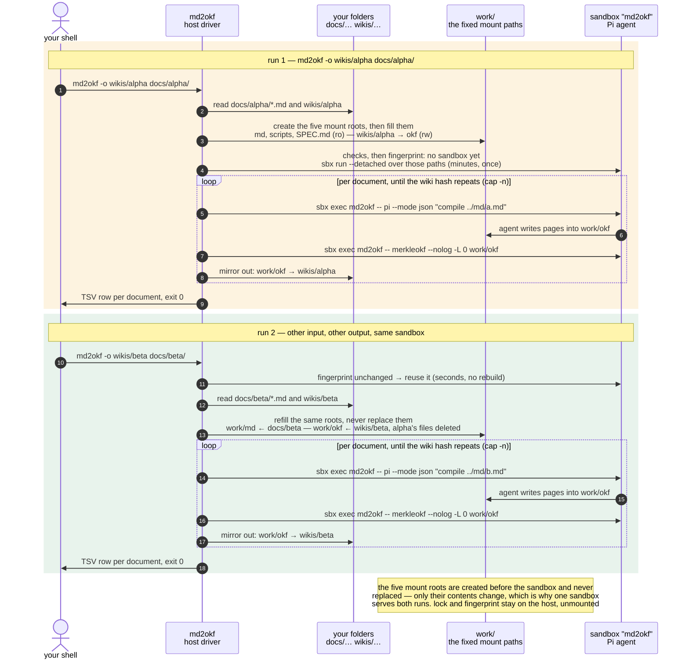
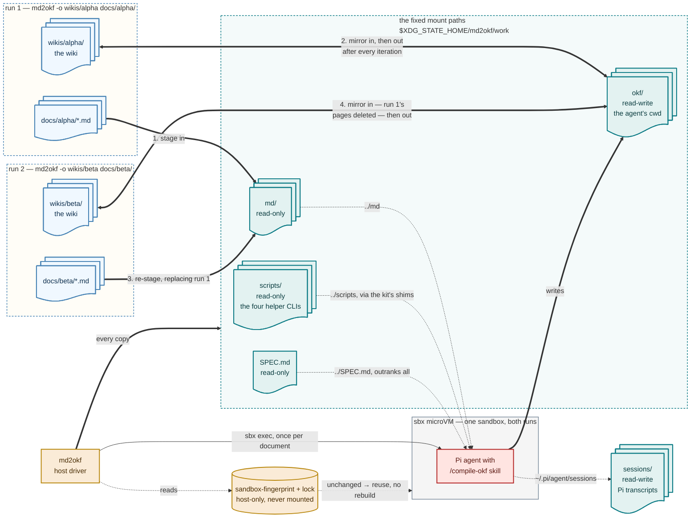

<!-- cspell:words argparse workbench uvx pipx hatchling sdist GHCR importlib flock progfile DEVNULL Popen nullglob pipefail shopt pypi mountpoint EROFS submounts virtiofs rmtree copytree lstat -->

# Plan: ship `md2okf` as a packaged primitive

## Context

Today the wiki is compiled by `make wiki`, which runs
`scripts/compile-okf.sh`, plus three sibling launchers (`scripts/bash.sh`,
`scripts/pi.sh`, `tests/test-sandbox.sh`) that each repeat the same sandbox
dance. That arrangement has six concrete defects:

- **Nothing in the driver is tested.** The Ralph loop, the prompt construction
  and the event rendering (`scripts/compile-okf.sh:89-130`) are reachable only
  through a live, paid, minutes-long sandbox run. Only mount selection and the
  guest-side state helper have host tests.
- **The launchers disagree.** `scripts/bash.sh:31-36` and
  `scripts/pi.sh:31-36` are the same eleven lines, reusing the sandbox via
  `sbx ls -q | grep -qx`; `scripts/compile-okf.sh:53` unconditionally runs
  `sbx rm --force`. Rebuild-versus-reuse is a property of which script you
  happened to run, not a flag.
- **Arguments are split between two entry points.** The source folder reaches
  only the script, the iteration cap only the environment (`RALPH_MAX`).
  Neither can compile a single document or show what would run.
- **The options are undiscoverable** — `RALPH_MAX`, the folder positional,
  `XDG_STATE_HOME` and `.env` live in script comments and README prose.
- **Host requirements serve the driver, not the user.** `jq` exists solely for
  the event filter at `scripts/compile-okf.sh:89-100`; `make` exists solely to
  reach the script.
- **It only works inside this checkout.** The tool cannot be pointed at someone
  else's folder, which is the thing it should be able to do.

The goal is a primitive in the `grep`/`awk` sense: one command, files in, a
directory out, flags for the few knobs, exit codes that mean something, no
subcommands, no project root, nothing to `cd` into — installed from PyPI with
the kit and the OKF spec inside the package, so it runs against any folder on
any machine that has `sbx`. Then it composes: pipelines
(`web2md … | md2okf -o okf/`), loops (`for f in …; do md2okf -o "wikis/$n" "$f"; done`),
other people's Makefiles, CI.

## The command

```text
md2okf [-o DIR] [--spec FILE] [-n N] [--fresh] [--dry-run] [-q | -v] [FILE|DIR ...]
md2okf --version | --help
```

| | `grep` / `awk` | `md2okf` |
| --- | --- | --- |
| program | the pattern; `awk -f progfile` | fixed (the `compile-okf` skill). `--spec FILE` swaps the OKF spec, awk's `-f`; default is the bundled `SPEC.md` |
| inputs | files; `-` or none means stdin | Markdown files, in the order given; a DIR means its `*.md`, sorted, non-recursive; `-` or no argument means stdin (refused on a TTY with usage, exit 2 — a paid, minutes-long run should not start on an idle terminal) |
| output | stdout | the wiki in `-o DIR` (default `./okf`, created if missing and **exclusively managed** — see the contracts below). stdout carries one TSV line per document and nothing else: `path  iterations  hash-before  hash-after` |
| diagnostics | stderr | the `Compiling … (iteration n)` and `hash -> hash` lines. `-v` adds Pi's tool calls and prose (today's `jq` view); `-q` suppresses rows and progress but never fatal diagnostics |
| exit status | 0 / 1 / 2 | 0 every document converged, **including a hash-stable first pass** — that is the documented idempotent re-run, not a failure; 1 the run failed: a document hit the iteration cap, a `pi` process exited non-zero, a session produced no tool calls at all, the wiki was empty before *and* after, the wiki hash came back empty or malformed, or mirroring the wiki back out failed — partial work is on disk and the document is named on stderr; 2 usage or environment, decided before any work starts (`sbx` missing or < 0.43, not logged in, key not proxy-managed, no documents, overlapping or unsafe paths, another run holds the sandbox) |
| state | none | one long-lived sandbox named `md2okf` (the name the `sbx secret` workaround is keyed to). Built on first use, reused after, rebuilt when the bundled kit changes or the mount set differs, and on `--fresh` |

**Not in the surface:** `compile`, `shell`, `pi`, `sandbox up/down/status`,
`doctor`, `lint`/`check`. Those are repository chores, not the tool's job.
`sbx exec -it md2okf -- bash` and `-- pi` are one-liners once a sandbox exists
and belong in `CONTRIBUTING.md`. The environment checks run on *every*
invocation and fail with the fix in the message, which is what `doctor` would
have been for — a check that only runs when asked prevents nothing. The wiki
gate stays `make check-okf`, which runs
`kits/md2okf/files/home/.pi/agent/skills/compile-okf/scripts/check-okf.sh`
(`okfctl` plus the frontmatter guard); putting it in the CLI would make
`okfctl` a requirement of a command that does not need it.

`RALPH_MAX` becomes `-n`. `.env` goes: a tool not tied to a checkout has no
repository to read a `.env` from, so `XDG_STATE_HOME` is the one knob, with
`~/.local/state` as the default.

### Contracts the first implementation must get right

Cheap to honour now, expensive to retrofit — each one is either a data-loss
path, a false success, or a promise consumers would build on.

- **`-o DIR` is exclusively managed, and adoption is proved rather than
  guessed.** Mirroring out propagates deletions, so pointing `-o` at a directory
  holding anything else would delete it. Adopt only a directory that does not
  exist, is empty, or is positively recognised as an OKF bundle root: a root
  `index.md` whose frontmatter declares `okf_version` and nothing else (§12 of
  the spec, the rule `frontmatter-guard.py:214-235` already enforces). The bare
  filename `index.md` is not a marker — documentation sites and note folders are
  full of them. Anything else is exit 2 naming the directory, with nothing
  written. No tool stamp file, so nothing extra has to be held out of the
  mirrored set.
- **The mount roots are created once and never replaced.** `sbx` binds the five
  workspace paths when the sandbox is created. Replacing one of those objects on
  the host — `rmtree` then `copytree`, or writing a new spec beside the old one
  and renaming over it — can leave the running VM attached to the old inode
  while the host driver sees a correct-looking tree, so run 2 would compile run
  1's sources or read run 1's spec. Create all five sources **before** the first
  `sbx run`, then keep those roots for the sandbox's lifetime: clear and
  repopulate the *children* of `work/okf`, `work/md` and `work/scripts`, rewrite
  `work/SPEC.md` in place (truncate and write, never rename over it), and never
  replace `sessions/`. A unit test records each root's inode across two
  stagings.
- **No symlinks, no special files.** Source documents and `--spec` must be
  regular files by an `lstat`-style check: a symlinked input would copy an
  unintended host file into the model's input. A symlinked `-o` root is
  rejected; mirroring never follows a symlink it meets in an existing output and
  never deletes through one; devices, sockets and FIFOs are rejected rather than
  reproduced. An OKF wiki and its Markdown inputs need none of these, so
  rejecting is simpler than defining semantics, and a fuller policy stays
  deferred.
- **Paths may not overlap.** Resolve the inputs, `-o`, `--spec` and the
  workbench, and refuse when one contains another — exit 2. Without it an
  output inside an input, or either inside the workbench, produces a recursive
  copy or a run that eats its own output.
- **A failed mirror-out is a failed run.** Disk space or permissions can break
  the copy back to `-o DIR`. Exit 1, name the workbench path that still holds
  the good wiki, and print no success row for that document.
- **Recovery after an interruption is best effort, not atomic.** A recursive
  copy can itself be interrupted and leave a mixed tree in `-o DIR`. A
  same-filesystem snapshot and atomic swap would make it a guarantee, and is a
  later refinement, not a v1 promise.
- **A missing or malformed hash is never convergence.** If `merkleokf` fails or
  prints nothing, an empty string compares equal to the previous empty string
  and the loop reports success having done nothing. Validate the hash — third
  line, first field, hex — before comparing.
- **Ctrl-C leaves the output directory as of the last completed pass.** On
  interruption, do not mirror out the half-finished iteration, release the lock,
  and exit non-zero. `-o DIR` then holds the last successfully mirrored pass,
  while `work/okf` may hold the partial one — the workbench is not a
  guaranteed-complete recovery copy.
- **`--dry-run` is local-only.** It resolves paths, enumerates documents and
  prints the mounts and command lines; it creates no directories, takes no
  lock, runs no `sbx`, and consumes nothing paid. It is the one exception to
  "the environment checks run on every invocation", and it says so in its
  output.
- **stdout carries the TSV and nothing else.** Every subprocess has its stdout
  captured and re-emitted on stderr, so `sbx run --detached`, `sbx rm` and the
  hash call cannot corrupt the stream. Rows print paths **as supplied**; a path
  containing a tab or a newline is rejected (exit 2); `-q` suppresses rows and
  progress but never fatal diagnostics. Stdin's row is labelled `-`, at most one
  `-` is accepted, and duplicate file arguments are compiled in the order given
  rather than de-duplicated — documented, not clever.
- **The lock is non-blocking; the sandbox is owned, not merely named.** The
  lock lives at a fixed per-user path — `/tmp/md2okf-<uid>.lock`, deliberately
  *not* under the configurable state directory, or two shells with different
  `XDG_STATE_HOME` values take two different locks while racing on the one
  sandbox named `md2okf`. A second invocation fails the lock immediately and
  exits 2; it does not queue. Reuse then requires proof of ownership, because a
  name is not an identity: the driver records the created sandbox's identity
  from `sbx inspect` beside the configuration fingerprint, and a later run
  requires the name to resolve to the same identity, the fingerprint to match,
  and a cheap in-VM probe (`work/okf` present) to pass. Both files are written
  atomically and only after a successful create, so a failed creation leaves no
  marker. A sandbox called `md2okf` that cannot be proved ours is **not**
  deleted automatically: exit 2 with the `sbx rm --force md2okf` command in the
  message. `--fresh` recreates a sandbox we own; it does not widen deletion
  authority. One-time migration cost: the sandbox today's launchers built is
  unowned, so the first run after the switch asks for that one command.

## Constraints that must hold

- **The sibling layout.** The kit's shims resolve the helper CLIs from
  `$(dirname "${WORKDIR}")/scripts/<cli>` (`kits/md2okf/spec.yaml:281-312`),
  and `../md/` and `../SPEC.md` are woven through the agent config
  (`kits/md2okf/files/home/.pi/agent/AGENTS.md:38-59`, the `compile-okf` and
  `inspect-md` skills). Breaking it costs an agent-prose migration, which is
  the expensive kind of change.
- **The driver is not the agent's business.** It runs on the host and must not
  live under a directory mounted into the VM. Mount only what the agent needs.
- **`sbx` is the runtime.** The command orchestrates `sbx run --detached`,
  `sbx exec` and `sbx rm`; `OPENROUTER_API_KEY` stays proxy-managed via
  `sbx secret`, keyed to the sandbox name `md2okf`.
- **The loop's sharp edges.** `stdin` must be `/dev/null` for non-interactive
  `pi` or the run hangs before its first API call; `merkleokf --nolog -L 0`
  must be given an absolute path to a directory named `okf`, or `log.md` is
  hashed and the loop never converges; the continuation prompt applies from
  iteration 2.
- **State precedence.** An exported absolute `XDG_STATE_HOME` wins, a relative
  value counts as unset, the default is `~/.local/state`, and the directory is
  created mode `0700` (`scripts/lib/sandbox-mounts.sh:38-48`).
- **Read-only has to mean read-only.** The agent treats every source document as
  untrusted, so `md/` and `SPEC.md` must be read-only as a property of the
  filesystem rather than of instructions — the reason the mount list exists at
  all (`scripts/lib/sandbox-mounts.sh:1-11`). That holds only while no
  read-write mount is an ancestor of a read-only one; see the invariant below.
- **`make` remains the developer task runner** for `lint`, `validate`,
  `check-okf` and the test suites. This plan is about the user-facing runtime
  command, not about repository chores.

## How one sandbox serves arbitrary paths

sbx fixes a sandbox's mounts at creation, `sbx run --name` re-attaches with the
old mounts, and a build takes minutes. A primitive that accepts arbitrary paths
therefore cannot mount them directly: a second `-o` would either rebuild every
time or silently write into the first wiki. Two things follow.

### One constraint worth reducing

The sibling layout is cheap to satisfy by staging, so only one piece of it is
worth changing in code this repository owns:

- **Un-gate `merkleokf --nolog`.**
  `scripts/merkleokf/src/merkleokf/merkle.py:110` skips the root log only when
  `root.name == "okf"`, which is why the hash call must name a directory
  literally called `okf`. That is a trap for any `-o DIR`; it is one condition
  plus a test.
- **Keep `../md/`, `../SPEC.md` and `../scripts/`.** Load-bearing in
  `AGENTS.md`, three skills and the kit's four shims; changing them is a
  prose-and-kit migration with agent-behaviour risk and no payoff. Stage them
  beside the wiki instead, which is what the workbench is for.

*Considered and rejected:* installing the four helper CLIs into the kit image —
carrying their sources under `kits/md2okf/files/` and `uv tool install`-ing them
at build time — to drop the `scripts:ro` mount. It does not shrink the package,
because the wheel force-includes the kit tree, so a copy under the kit ships
anyway; it leaves two source trees for the same four projects with nothing
pinning them together, which is the failure the zero-overlap rule exists to
prevent (`AGENTS.md:57`); and the mount it removes costs nothing once the
workbench stages siblings. Its one real advantage — a pre-installed binary
instead of `uv tool run --from` per call — is not worth a duplicated tree.
Publishing the four CLIs to PyPI and pinning them in the kit would buy it
properly, and is out of scope here.

### The workbench

What remains is a fixed staging layout under the state directory, mirrored in
and out:

```text
~/.local/state/md2okf/       $XDG_STATE_HOME/md2okf — the root is NOT mounted
  sessions/                  mount, rw           <- Pi sessions (mount-state.sh); the only
                                                    state path the VM can reach
  work/                      not mounted as a whole — only the three paths below are
    okf/                     primary mount, rw   <- mirrored from -o DIR before the run,
                                                    back to it after every iteration
    md/                      mount, ro           <- the inputs, copied by basename
                                                    (stdin -> stdin.md; a basename clash is exit 2)
    scripts/                 mount, ro           <- the four helper CLI projects
                                                    (pyproject.toml + src), staged from the package
    SPEC.md                  mount, ro           <- --spec, or the bundled copy
  sandbox-fingerprint        host-only: kit tree hash + tool version + mount set,
                             written atomically after a successful create

/tmp/md2okf-<uid>.lock       host-only, outside the configurable state dir:
                             flock, one run at a time; a second invocation exits 2
```

This reproduces the sibling layout the kit expects, so **the kit's agent config
does not change**. The wiki copy is Markdown-sized. All five mount sources are
created before the first `sbx run` — `sbx` cannot be the step that precedes the
existence of the paths it is asked to mount — and from then on only their
contents change, never the root objects themselves. Mirroring back after every
iteration means an interrupted run leaves the last completed pass in `-o DIR`,
best effort rather than guaranteed, since the copy itself can be interrupted.
The staged `SPEC.md` is also what the frontmatter guard reads inside the VM as
`../SPEC.md`, so the gate the agent runs before it finishes keeps working;
running that gate on the host against an `-o DIR` with no sibling spec needs
`SPEC_MD` pointed at one, which the README should say.

Seen from inside the VM, where every mount appears at its host absolute path,
that staging area *is* the bundle layout the agent config assumes:

```text
$XDG_STATE_HOME/md2okf/            the root and work/ are bare mountpoint parents,
└── work/                          not mounts — nothing else of theirs is shared
    ├── okf/          rw, primary mount — the agent's working directory, the wiki root
    ├── md/           ro — the staged inputs for this run        (reached as ../md)
    ├── scripts/      ro — the four helper CLI projects          (reached as ../scripts)
    └── SPEC.md       ro — --spec, or the bundled copy           (reached as ../SPEC.md)
$XDG_STATE_HOME/md2okf/sessions/   rw — bind-mounted onto ~/.pi/agent/sessions

never mounted, so invisible inside the VM:
  sandbox-fingerprint, lock                               <- host-side control files

in the image, never mounted:
  pi, okfctl, uv                                          <- installed at kit build time
  ~/.pi/agent/{AGENTS.md, settings.json, models.json, skills/}
  ~/.local/bin/{inspectmd,inspectokf,sizeokf,merkleokf}   <- shims that run ../scripts/<cli>
```

Five mounts, and one invariant: **no read-write mount may be an ancestor of a
read-only one.** `sbx` enforces `:ro` on the host side — inside a sandbox,
`sudo mount -o remount,rw` on a read-only workspace returns 0 and writes still
fail with `EROFS` — so a read-only mount holds even against root in the guest.
That guarantee survives only while nothing writable contains it: a plain
`mount --bind` does not replicate nested submounts, so binding a writable
parent elsewhere exposes the underlying writable view of everything below it,
and the kit's own `agentInstructions` state that `sudo` is passwordless
(`kits/md2okf/spec.yaml:51`). Mounting the state *root* read-write, as today's
launchers do, would therefore put `work/md`, `work/scripts` and `work/SPEC.md`
one `mount --bind` away from writable, and hand the agent the `lock` and
`sandbox-fingerprint` outright — an injected source document could rewrite the
spec the run is held to, and `check-okf.sh` would then validate the wiki
against the tampered `../SPEC.md`. So `sessions/` is mounted, not the root.
`MD2OKF_STATE_DIR` still names the root, which is what the guest helper
expects.

Nothing above `work/` is reachable from the wiki, so `../md` and `../SPEC.md`
resolve exactly as they do today and no host path outside the staging area is
visible to the agent.

### Two runs, two wikis, one sandbox

<!-- cspell:disable -->



<br>*Two `md2okf` invocations against different inputs and different outputs.
The five mount paths — `work/okf` read-write, `work/md`, `work/scripts` and
`work/SPEC.md` read-only, and `sessions/` read-write for Pi's transcripts — are
the same in both runs; only what sits inside them changes, so
run 2 finds the fingerprint unchanged and reuses the sandbox instead of paying
for a rebuild. The roots themselves are created before the first `sbx run` and
then kept for the sandbox's lifetime — restaging clears and refills them rather
than replacing them, or the VM could stay attached to run 1's objects. The host
driver owns every copy: it stages the inputs and mirrors the wiki **in** before
the run, so an existing wiki is continued rather
than restarted, and mirrors it **out** after every iteration, so an interrupted
run still leaves the last completed pass in `-o DIR`. Mirroring is a sync, not
an append: re-staging for run 2 deletes run 1's pages from `work/okf`, which is
what keeps `wikis/alpha` out of `wikis/beta`. The agent sees only the five
mounts — never the state root, so the `lock` and `sandbox-fingerprint` it would
otherwise be able to rewrite are not in its namespace — and the `flock` is
non-blocking, so a second run overlapping the first exits 2 rather than
queueing behind it.*

### The same two runs, without the time axis



<br>*The same two invocations as a flow. Your folders (blue) sit at arbitrary
paths and differ per run; the staging area (teal) is the same four paths every
time, which is why the fingerprint matches and one microVM (gray) serves both
runs. The host driver (amber) owns every copy in and out — the agent (red)
never sees a path of yours, only `work/`, where it reads `../md`, `../scripts`
and `../SPEC.md` and writes the wiki. The numbered edges are the order of events:
inputs are staged, the target wiki is mirrored in so an existing wiki is
continued rather than restarted, and the wiki is mirrored back out after every
iteration. Run 2 re-stages the same paths, and mirroring in deletes run 1's
pages, which is what keeps `wikis/alpha` out of `wikis/beta`. The state root is
not mounted: `sessions/` is shared on its own so that the fingerprint and the
lock stay host-side, and so that no writable mount sits above the two read-only
ones.*

<!-- cspell:enable -->

## Packaging: a pure-Python wheel on PyPI

A stdlib-only project at the repository root, laid out like the four helper
CLIs, with the kit and `SPEC.md` carried as package data. `uv build` produces a
pure wheel and an sdist; the release workflow publishes them to PyPI by trusted
publishing (OIDC, no stored token) and attaches them to the GitHub Release.

```bash
uv tool install md2okf                                   # from PyPI
uvx md2okf -o okf/ doc.md                                # no install at all
uv tool install git+https://github.com/lars20070/md2okf  # straight from source, any ref
uv tool install md2okf==0.2.0                            # pinned
```

The driver is Python: argparse, native JSON for Pi's event stream (no `jq`),
`subprocess` for `sbx`. `importlib.resources` locates the assets in the
installed wheel; in a checkout it falls back to `kits/md2okf/` and `SPEC.md`,
so `uv run md2okf` works during development without a build.

### Alternatives considered

| | PyPI wheel (chosen) | Homebrew tap | OCI kit on GHCR |
| --- | --- | --- | --- |
| Install | `uv tool install md2okf`; `uvx` with none | `brew install lars20070/tap/md2okf` | none — `sbx run ghcr.io/…` behind a shell function |
| Host requirements | `sbx`, `uv` (or `pipx` / Python ≥ 3.12) | `sbx`, `jq` | `sbx` only |
| Driver | Python, argparse, pytest | Bash, hand-rolled options | POSIX `sh` inside the VM |
| Any paths, one sandbox | yes | yes, in Bash | **no** — mounts fixed at creation |
| Loop testable offline | yes | no | no |
| macOS / Linux | identical | Linux second-class | identical |
| Effort | 2–3 days | ~2 days plus tap upkeep | ~1 day |

**Not the Homebrew tap**, because its driver is Bash — every complaint about
hand-rolled option parsing and an untested loop carries over — and because it
means two artifacts (tarball, formula) in a second repository, with Linux
second-class. It is a good *second channel* once the wheel exists: a formula
that wraps the wheel, added then, not now.

**Not the OCI kit**, because the interface would be `sbx run`'s — positional
mount soup, `--` separation, kit args — which is the opposite of the brief; and
because with no host process, nothing can notice that the sandbox named
`md2okf` was created with different mounts, so pointing it at a second wiki
silently writes into the first. That is a correctness trap, not an ergonomic
one.

## Implementation

### Layout

The checkout after stage 5, with what is new, changed and gone:

```text
md2okf/                          the repository — and now the Python project root
├── pyproject.toml               NEW      name/entry point; version read from VERSION
├── uv.lock                      NEW
├── src/md2okf/                  NEW      the driver (module split below)
├── tests/                       CHANGED  driver pytest suite joins the shell tests
│   ├── test_cli.py … test_package.py     NEW
│   ├── test-sandbox.sh                   kept; ensures the sandbox via python -m md2okf.sandbox
│   ├── test-sandbox-guest.sh             kept; runs inside the VM
│   ├── test-mount-state.sh               kept; guest-side state helper
│   └── test-sandbox-mounts.sh            GONE -> tests/test_workbench.py
├── kits/md2okf/                 UNTOUCHED  the sandbox kit, shims and all
│   ├── spec.yaml                            the four workspace-backed CLI shims stay
│   └── files/home/
│       ├── .local/lib/md2okf/mount-state.sh   untouched (guest-side)
│       └── .pi/agent/                         untouched: AGENTS.md, settings.json,
│                                              models.json, skills/{compile-okf,
│                                              curate-okf, inspect-md, inspect-okf,
│                                              size-okf, merkle-okf}
├── scripts/                     CHANGED  only the helper CLI projects and chores remain
│   ├── inspectmd/ inspectokf/ sizeokf/ merkleokf/   pyproject.toml + src/ + tests/
│   ├── validate-spec.sh release-notes.sh check-release-tag.sh sync-descriptions.py
│   ├── compile-okf.sh                    GONE -> src/md2okf/compile.py, events.py
│   ├── bash.sh  pi.sh                    GONE -> sbx exec one-liners in CONTRIBUTING.md
│   └── lib/sandbox-mounts.sh             GONE -> workbench.py + sandbox.py
├── md/                          source documents — one input among many now
├── okf/                         the default output wiki, gitignored, created if missing
├── SPEC.md                      the OKF revision; bundled into the wheel
├── VERSION                      single source of the package version
├── Makefile                     CHANGED  wiki delegates, then goes; + install, test-md2okf
├── .github/workflows/           CHANGED  ci.yml gains two jobs; release.yml gains publish
├── web2md/  pdf2md/             upstream stages, untouched
└── README.md AGENTS.md CONTRIBUTING.md CHANGELOG.md   CHANGED (docs)
```

The driver itself, and the wheel it builds into:

```text
pyproject.toml              name = "md2okf"; version from VERSION (hatch regex source);
                            [project.scripts] md2okf = "md2okf.cli:main"; hatchling;
                            requires-python >= 3.12; no dependencies; ruff + pytest as the CLIs
src/md2okf/
  __init__.py               __version__ from importlib.metadata
  cli.py                    argparse: the one command; main() returns the exit code
  resources.py              kit_dir(), spec_md(), clis_dir(): the installed package's
                            copies, else the checkout's (kits/md2okf, SPEC.md,
                            scripts/<cli>)
  workbench.py              state dir (XDG precedence), work/ layout created once,
                            inode-preserving restaging, mirror in/out, non-blocking
                            lock, fingerprint + recorded sandbox identity
  sandbox.py                the one sbx seam: present/version/login checks, exists(),
                            identity(), create(), remove(), exec(argv, stdin=DEVNULL,
                            stream=…), key check; `python -m md2okf.sandbox` ensures
                            one (maintainers)
  compile.py                documents(), the two prompts, the Ralph loop, hash, TSV rows;
                            convergence = unchanged hash, iteration 1 included
  events.py                 one `pi --mode json` line -> text (replaces the jq filter),
                            and a tool-call count: zero means the skill never ran
tests/
  test_cli.py test_workbench.py test_sandbox.py test_compile.py test_events.py
  test_resources.py test_package.py       (pytest; the shell tests keep their test-*.sh names)
```

Root project, not a subdirectory: the repository name is the tool name, and a
root `pyproject.toml` is what makes
`uv tool install git+https://github.com/lars20070/md2okf` and
`uvx --from git+… md2okf` work with no registry. It is also the only form that
can take `VERSION` as a hatch version source — a subdirectory project cannot
read a file above its own root, which would leave the tool reporting a version
that disagrees with `VERSION` and `CHANGELOG.md`. `CONTRIBUTING.md`'s "no
project at the root" rule exists to keep `uv run` and the lint boundaries
per-directory; `uv run --project web2md` and the per-directory `[tool.ruff]`
tables keep doing that, and the wheel build lists `src/md2okf` explicitly so
`web2md/`, `pdf2md/` and `md/` cannot leak in.

Wheel contents, via `[tool.hatch.build.targets.wheel.force-include]`:
`kits/md2okf` → `md2okf/kit`, `SPEC.md` → `md2okf/SPEC.md`, and for each helper
CLI `scripts/<cli>/pyproject.toml` and `scripts/<cli>/src` →
`md2okf/clis/<cli>/…`. Name those two paths per project rather than the project
directory: the four working directories hold about **40 MB** of ignored `.venv`
and cache trees against **172 KB** of source, so a recursive directory include
is a 200-fold blowup, and `tests/`, `uv.lock` and `README.md` are not needed at
runtime either. `tests/test_package.py` builds the wheel and asserts the wanted
paths exist and that no `.venv`, `.ruff_cache`, `.pytest_cache`, `tests/`,
`uv.lock` or `.DS_Store` does. Load the `context7-docs` skill for hatchling's
force-include and version-source syntax — including whether force-include
honours VCS ignores — before writing the file.

### Behaviour to carry over, and from where

- `scripts/compile-okf.sh:28-32` — the two prompt strings and the "append the
  continuation from iteration 2" rule → `compile.py`.
- `scripts/compile-okf.sh:83-86` — `merkleokf --nolog -L 0 <abs okf>`, third
  line, first field → `compile.py`; the absolute path is the workbench's
  `work/okf`. Validate what comes back — a missing or non-hex field is a
  failure, never a convergence.
- `scripts/compile-okf.sh:89-100` — the jq filter → `events.py`: the same three
  cases (`tool_execution_start` as `toolName args`, assistant `message_end`
  text and thinking), 120-character cut.
- `scripts/compile-okf.sh:102-130` — the loop and cap → `compile.py`;
  `RALPH_MAX` becomes `-n`, default 10; exit 1 naming the document.
- `scripts/compile-okf.sh:63-67` — `stdin=subprocess.DEVNULL` on every
  non-interactive `sbx exec … pi`, with the reason in a comment and a test.
- `scripts/lib/sandbox-mounts.sh:38-48` — absolute-or-unset `XDG_STATE_HOME`,
  `mkdir -p`, mode `0700` → `workbench.py`. Drop the `.env` layer.
- `scripts/lib/sandbox-mounts.sh:56-62` — mount order → `sandbox.create()`,
  with the workbench paths and one deliberate change: the writable state mount
  narrows from the state root to `$XDG_STATE_HOME/md2okf/sessions`. The list
  becomes `work/okf` (primary, rw), `work/md:ro`, `work/scripts:ro`,
  `work/SPEC.md:ro`, `…/md2okf/sessions` (rw) — five mounts, same order and
  count as today, no writable one an ancestor of a read-only one.
- `scripts/bash.sh:31-36` — the `sbx ls -q | grep -qx` existence check and
  `sbx run --detached --name md2okf -e MD2OKF_STATE_DIR=… <kit> <mounts>` →
  `sandbox.py`. The existence check is no longer sufficient on its own: it
  gains the recorded sandbox identity, the configuration fingerprint and the
  in-VM probe, all three written or checked as the ownership contract describes.
- `scripts/compile-okf.sh:34-38` — the `brew install docker/tap/sbx` hint, plus
  new checks: `sbx version` ≥ 0.43.0, `sbx ls` succeeds (logged in), and after
  creation `sbx exec md2okf -- sh -lc 'echo "$OPENROUTER_API_KEY"'` prints
  `proxy-managed`, else exit 2 with the two `sbx secret` commands in the
  message.
- `kits/md2okf/files/home/.local/lib/md2okf/mount-state.sh` and
  `tests/test-mount-state.sh` — untouched; guest-side.

Six behaviours the shell has implicitly, which a Python port silently loses or
breaks:

- **Exit-status propagation.** `scripts/compile-okf.sh:2` sets `pipefail`, so a
  failing `sbx exec … pi` aborts the run. A `Popen` loop over stdout drops the
  return code, and a Pi that dies on iteration 1 then *looks* like convergence:
  the hash did not change, so the loop calls the document done and exits 0.
  Check the return code explicitly; test it.
- **Convergence versus "did nothing" — do not conflate them.** A hash-stable
  pass *is* convergence, including on iteration 1: that is exactly what
  re-compiling an already-compiled document produces, and it is a documented
  guarantee (`README.md:256`, "compiling the same document twice is safe").
  `merkleokf --nolog` exists so an appended log entry cannot mask it, and the
  log is no help as a tie-breaker either — the rule is one entry *per page
  created or updated* (`kits/…/.pi/agent/AGENTS.md:162-164`), so a run that
  legitimately changes nothing appends nothing. Keep today's rule: unchanged
  hash → exit 0, with a row carrying `iterations=1` and equal hashes. The real
  "Pi exited 0 having done nothing" signal is the event stream, not the hash:
  `compile-okf/SKILL.md:20-28` makes reading `../SPEC.md` and the source the
  first two steps, so a session with **zero** `tool_execution_start` events did
  not follow the skill — that is a failure, as is a wiki that was empty before
  the run and is still empty after.
- **An empty source folder.** `shopt -s nullglob`
  (`scripts/compile-okf.sh:103`) means a folder with no `*.md` exits 0 having
  done nothing. For a primitive whose exit status is the verdict, that is exit
  2 with "no documents".
- **`okf/` may not exist.** `okf/.okflintrc.json` was the only tracked file
  under `okf/`; it is gone and `.gitignore:21` ignores the rest, so a fresh
  clone has no `okf/` for `sbx run ./okf …` to mount. The driver must
  `mkdir -p` the wiki root before mounting. That is stage 1, ahead of the rest
  of this plan.
- **`sbx rm --force md2okf || true`.** The tolerated failure is load-bearing on
  a first run; `subprocess.run(check=True)` would break it.
- **The glob is not recursive.** `*.md` directly inside the folder, sorted.

### Repository changes

- (stage 2) Add `pyproject.toml`, `src/md2okf/`, the pytest suite; `uv lock`.
- (no stage) `kits/md2okf/` stays unchanged, shims included. The workbench
  stages `work/scripts`, so `$(dirname "${WORKDIR}")/scripts/<cli>` resolves
  exactly as it does today.
- (stage 1) `scripts/lib/sandbox-mounts.sh`: `mkdir -p` the wiki root before
  it is mounted, so a fresh clone with no `okf/` works.
- (stage 1) `scripts/merkleokf/`: drop the `root.name == "okf"` condition in
  `merkle.py:110`; add the test that `--nolog` works for a wiki directory under
  any name, and keep the existing nested-`okf/` case passing.
- (stage 5) Retire `scripts/compile-okf.sh`, `scripts/bash.sh`, `scripts/pi.sh`,
  `scripts/lib/sandbox-mounts.sh`, `.env.example`, the `.env` lines in
  `.gitignore` and `README.md`, and `tests/test-sandbox-mounts.sh` (its
  precedence cases become `tests/test_workbench.py`).
- (stages 3 and 5) `tests/test-sandbox.sh`: the mount-invariant assertions land
  with the mount change in stage 3; `uv run python -m md2okf.sandbox` replaces
  its own create step in stage 5, before its existing `sbx exec … sh -l -s`.
  `tests/test-sandbox-guest.sh`: the mount count is unchanged at five, but the
  state-mount path is now `sessions/`, not the state root.
- (stages 2, 3 and 5) `Makefile`: `test-md2okf` (`uv run --group test pytest
  tests`) added to `test`, and `install` (`uv tool install --force .`) beside
  `install-clis`, both in stage 2; `wiki` → `uv run md2okf md/` in stage 3, and
  `wiki` itself goes in stage 5; `check-okf` unchanged; the ruff glob at `Makefile:53` gains the root project
  (`'pyproject.toml' '*/pyproject.toml'`), whose `dirname` is `.` — scope the
  root project's `[tool.ruff]` so the tree walk does not pull in `md/` or
  `okf/`.
- (stages 2 and 4) `.github/workflows/ci.yml`: a `test-md2okf` job (pytest) in
  stage 2, and a `build-package` job in stage 4 (`uv build`, the sdist-to-wheel
  rebuild, then `uvx --from dist/*.whl md2okf --help`).
- (stage 6) `.github/workflows/release.yml`: a `publish` job — `uv build` and
  `uv publish` with trusted publishing (`id-token: write`, the `pypi`
  environment) — ordered explicitly against the existing `github-release` job
  rather than beside it, since both depending on `verify` alone lets
  `gh release upload` race a Release that does not exist yet. The upload needs
  `contents: write` and `GH_TOKEN`, and a re-run after a partial upload must be
  safe. One-time owner action: create the PyPI project `md2okf` and register
  the repository as its trusted publisher.
- (stages 5 and 6) `README.md`: Requirements become `sbx` and `uv`; Quickstart
  becomes `uv tool install .` then `md2okf my-document.md` in stage 5, and gains
  the `uv tool install md2okf` PyPI line only in stage 6; "How it works" gains
  the workbench and loses "always rebuilds"; Troubleshooting trades `RALPH_MAX`
  for `-n` and gains the `SPEC_MD` note for host-side checks; the diagram's
  driver box becomes `md2okf`.
- (stage 5) `CONTRIBUTING.md`: the Python-layout section (a root project now
  exists, and why), the Releasing section (there *is* a package to publish), the
  command
  table, and the two maintainer one-liners that replace `bash.sh` and `pi.sh`.
  `AGENTS.md`: repository map and command table. `kits/md2okf/README.md`:
  "which `make wiki` always builds" → "which `md2okf` rebuilds when the kit
  changes, or on `--fresh`".
- (stage 5; the PyPI line in stage 6) `CHANGELOG.md` under `[Unreleased]`:
  Added the `md2okf` command and the PyPI package; Removed the launchers,
  `sandbox-mounts.sh` and `.env`; Changed the host requirements, the sandbox
  reuse rule, the writable state mount (`sessions/`, not the state root) and
  `merkleokf --nolog`.
- (stage 2) `.cspell.json`: `argparse`, `uvx`, `hatchling`, `workbench`, and
  whatever the sources add.

## Stages and checkpoints

Six stages, each ending in a checkpoint that must pass before the next one
starts. Every checkpoint leaves the repository working: the documented compile
path still runs, CI still passes, nothing is half-migrated, and the previous
stage is still the rollback. The driver is finished offline *before* it touches
a sandbox, so no stage builds a path model that a later stage throws away. Only
stage 3 spends money.

### Stage 1 — Two independent fixes (~1 hour)

Neither touches the driver architecture, and both are worth having even if the
rest of this plan never happens.

- Create the wiki root before mounting it: a fresh clone has no `okf/` since
  `okf/.okflintrc.json` was removed, so `mkdir -p` belongs in
  `scripts/lib/sandbox-mounts.sh` now and in `workbench.py` later.
- Un-gate `merkleokf --nolog`: drop the `root.name == "okf"` condition at
  `scripts/merkleokf/src/merkleokf/merkle.py:110`, keeping the nested-`okf/`
  case passing.

**Checkpoint.** `make lint`, `make validate` (required by `AGENTS.md` once a
shell script under `scripts/` changes), `make test-clis` and `make test-shell`
pass; a `--nolog` hash of a directory *not* named `okf` now skips its root
`log.md`; `rm -rf okf && make wiki` gets as far as creating the sandbox on a
tree with no `okf/`. Safe to stop here — this is an ordinary bug-fix release.

### Stage 2 — The complete command, offline (~2 days)

The whole driver, in its final shape: `resources`, the workbench with the
layout above, inode-preserving restaging, mirror in and out, the non-blocking
lock, the fingerprint and recorded sandbox identity, the sbx seam, the Ralph
loop, `events`, every contract, and the pytest suite that pins them — all
exercised against a fake `sbx`. **Nothing in the repository's behaviour
changes**: `make wiki` and all four launchers stay on the shell path.

**Checkpoint.**

- `make lint`, `make validate`, `make test-shell`, `make test-web2md`,
  `make test-clis` — unchanged and green; `make wiki` still runs the shell
  driver.
- `make test-md2okf`, offline with a fake `sbx` recorded per test:
  - **loop** — a non-zero `pi` → exit 1, not false convergence; an empty or
    malformed hash → exit 1; a hash-stable first pass → exit 0 with
    `iterations=1` and equal hashes; zero tool calls → exit 1; a wiki empty
    before and after → exit 1; the cap → exit 1 naming the document; the
    continuation prompt from iteration 2; `stdin=DEVNULL`.
  - **staging** — mirror in and out including deletion; a dirty workbench left
    by a different `-o`; an injected mirror-out failure → exit 1 naming the
    workbench copy, with no success row; the inode of each mount root unchanged
    across two stagings, and `work/SPEC.md` rewritten in place.
  - **ownership** — a missing or empty `-o` adopted; an `-o` whose root
    `index.md` declares `okf_version` adopted; a non-empty directory holding a
    plain `index.md` rejected **without modification**.
  - **safety** — symlinked input, symlinked `--spec`, symlinked `-o` root, and
    a symlink inside an existing output all refused or never followed; devices
    and FIFOs rejected; overlapping paths → 2; a tab or newline in a path → 2;
    a basename clash → 2; stdin on a TTY → 2; more than one `-` → 2; no
    documents → 2.
  - **identity** — a matching fingerprint with a different sandbox identity is
    not reused; a stale fingerprint from a failed create is not trusted; an
    unknown sandbox occupying the name → exit 2 with the removal command and
    nothing deleted.
  - **streams** — no subprocess output ever reaches stdout; `-q` still prints
    fatal diagnostics; `events.py` against recorded Pi lines.
- `md2okf --dry-run -o /tmp/w ~/some.md`, run from a directory that is *not*
  the checkout, prints the mounts, the documents and the command lines while
  creating nothing, taking no lock and calling no `sbx`.

Safe to stop here: the repository behaves exactly as before, and the driver is
complete but dormant.

### Stage 3 — Sandbox integration and the default switch (~1 day)

The driver's first live use: the narrowed mount set, a real sandbox, paid
compiles, and only at the end does `make wiki` change hands. The shell scripts
stay as the rollback path.

**Checkpoint.**

- `sbx rm --force md2okf` first — the sandbox today's launchers built is
  unowned by design, and the driver refuses to delete it for you.
- `make test-sandbox` passes against the sandbox the driver creates, and its
  new assertions hold from inside the VM: `lock` and `sandbox-fingerprint` are
  not visible; no read-write mount is an ancestor of a read-only one; writes to
  `../md/*` and `../SPEC.md` still fail **after** `sudo mount --bind` of every
  writable mount to a scratch path; `~/.pi/agent/sessions` is still bound onto
  the host now that only `sessions/` is mounted.
- Paid, and the point of the stage: compile document A into `-o wikis/alpha`
  from a folder outside the checkout; then compile a *different* document B,
  from a *different* source folder, with a *different* `--spec` file, into
  `-o wikis/beta`. The reused VM must see the new sources and the new spec —
  not run 1's — the sandbox must not be rebuilt, and alpha's pages must not
  appear in beta. This is what proves the restaging rules.
- Re-run one document unchanged: one iteration, equal hashes, exit 0.
- `make check-okf` on both wikis, with `SPEC_MD` pointed at the checkout's spec
  since neither has a sibling one.
- Then, and only then, `make wiki` → `uv run md2okf md/`; one more paid run
  through that path, and `make check-okf` on `./okf`.

Safe to stop here: the default path is the new driver, and
`./scripts/compile-okf.sh` is one command away if it misbehaves.

### Stage 4 — Distribution proof (~half a day)

Wheel and sdist configuration and the `build-package` CI job. Nothing is
published and nothing is deleted; this stage exists so that the cutover cannot
delete the old path before an installable artifact is known to exist.

**Checkpoint.**

- `uv build` produces both artifacts; `unzip -l dist/md2okf-*.whl` shows
  `md2okf/kit/spec.yaml`, `md2okf/kit/files/home/.pi/agent/AGENTS.md`,
  `md2okf/SPEC.md`, `md2okf/clis/merkleokf/pyproject.toml` and its `src/`, and
  none of `.venv`, `.ruff_cache`, `.pytest_cache`, `tests/`, `uv.lock` or
  `.DS_Store`; the archive is a few hundred KB, not tens of MB.
- A wheel built **from the sdist** in an empty directory installs and runs:
  `uv build --wheel dist/md2okf-*.tar.gz`, then `uvx --from <that wheel>
  md2okf --help` and a `--dry-run` from a directory that is not the checkout.
  `uv build` normally builds the wheel from the sdist, so anything the sdist
  omits breaks here rather than after release.
- The `build-package` CI job is green on a pull request.

Safe to stop here: the tool works from a built artifact, and the old path is
still intact.

### Stage 5 — Cutover (~half a day)

Now delete the old path: `scripts/compile-okf.sh`, `scripts/bash.sh`,
`scripts/pi.sh`, `scripts/lib/sandbox-mounts.sh`, `.env.example` and the `.env`
lines; port `tests/test-sandbox-mounts.sh` to `tests/test_workbench.py`; point
`tests/test-sandbox.sh` at `python -m md2okf.sandbox`; update `README.md`,
`CONTRIBUTING.md`, `AGENTS.md`, `kits/md2okf/README.md` and `CHANGELOG.md`.
The README documents `uv tool install .` and the `git+https` form — the PyPI
line is stage 6's to add, because until then it would be false.

**Checkpoint.**

- `make lint && make validate && make test` all green — `make test` now
  includes `test-md2okf`.
- `git grep -n 'compile-okf\.sh\|bash\.sh\|pi\.sh\|sandbox-mounts\|RALPH_MAX\|\.env'`
  returns only deliberate mentions: CHANGELOG history and the kit's own
  `check-okf.sh`.
- A clean clone into a temporary directory: `uv run md2okf --help` and
  `md2okf --dry-run md/` work with no `.env` and no launchers present, and the
  stage 4 wheel installs and runs there too.

Safe to stop here: this is the release everything above was building toward.

### Stage 6 — Publish (~half a day, plus PyPI registration)

Trusted publishing, the release workflow's ordering, and the PyPI install
lines in `README.md` and `CHANGELOG.md`.

**Checkpoint.**

- The release workflow has one ordering, not two racing jobs. `release.yml`
  today runs `verify` then `github-release: needs: [verify]`; a `publish` job
  that also merely needs `verify` runs *concurrently* with it, so
  `gh release upload` can fire before the Release exists. Make it explicit:
  publish to PyPI, then have `github-release` depend on publication, or have a
  separate upload job depend on both. The PyPI job needs `id-token: write` and
  the `pypi` environment; the upload job needs `contents: write` and
  `GH_TOKEN`. Re-running after a partial upload must be safe.
- The PyPI project exists and this repository is registered as its trusted
  publisher **before** the first `vX.Y.Z` tag is pushed — a pending publisher
  does not reserve the name.
- `SPEC.md`'s provenance is settled before it ships inside an artifact. The
  file currently carries no licence, copyright or upstream URL, while the
  repository ships one MIT `LICENSE`; the upstream Open Knowledge Format is
  Apache-2.0. Record the source and revision, carry the required licence and
  attribution in both the wheel and the sdist, and note whether the bundled
  copy is modified.
- After the tag: the GitHub Release carries both artifacts, and
  `uvx md2okf --help` works from PyPI on a machine that has never seen the
  checkout.

Safe to stop here, and this is the last stage.

## Risks and open items

- **Unverified: which `sbx inspect` field is a stable sandbox identity.** The
  ownership rule needs one value that changes when the sandbox is recreated.
  Confirm on the host in stage 3 and pin the field then. If none exists, the
  fallback needs no `inspect` at all: write a random token inside the VM at
  creation (`sbx exec md2okf -- sh -c 'echo … > /tmp/md2okf-owner'`) and read it
  back on reuse — `/tmp` does not survive a recreated sandbox, which is exactly
  the property being tested.
- **Unverified: how a replaced mount root behaves.** The restaging rule assumes
  that swapping a mounted directory or file on the host can leave the VM on the
  old object. That is the defensive assumption either way — preserving the roots
  costs nothing — but the inode test and the stage 3 two-spec run are what
  actually prove the staged contents reach the reused sandbox.
- **Resolved by construction: a missing workspace path at `sbx run`.** All five
  mount sources are created before the sandbox is, so what `sbx run` would do
  with a path that does not exist never comes up.
- **Force-including non-Python assets** is a packaging detail that must be
  verified by listing the wheel — the helper CLI directories carry ~40 MB of
  ignored `.venv` and cache trees around 172 KB of source, so an over-broad
  include is a real failure mode, not a theoretical one. The in-checkout
  fallback is a second code path — one function, tested.
- **PyPI registration is a one-time owner action** and blocks stage 5 only.
- **`mount-state.sh` against the narrower mount.** Mounting `sessions/` rather
  than the state root changes the granularity the guest helper was written for.
  Its contract (`$MD2OKF_STATE_DIR/sessions`) is unchanged, and the env var
  still names the root, but the first live run after the change is the proof.
- **A guest with sudo can still deny service on the mounts.** All of a
  sandbox's host shares appear to sit on one virtiofs superblock: a
  `mount -o remount,ro` on any one of them flips every share in the VM to
  read-only until it is remounted (observed while testing this plan). That
  costs a failed run, not data — a host-side read-only export stays read-only
  whatever the guest does — but it means the driver should treat a sudden
  `EROFS` on `work/okf` as a runtime failure with a clear message rather than
  as a mirroring bug.
- **Deferred on purpose, and recorded so they are not lost.** A same-filesystem
  snapshot and atomic swap for mirror-out; a full symlink, device and
  permission policy for staging; signal forwarding and remote-process reaping
  beyond "don't mirror a partial iteration"; comparing every `sbx inspect`
  field on every run, now that identity plus fingerprint plus probe bound the
  question; a general-purpose filesystem-copy policy beyond the rejection rule;
  recursive directory input; and a prebuilt or OCI distribution. Each is a
  refinement on a correct baseline, not a gap in one.
- **Effort estimates are judgement**, not measurement.
