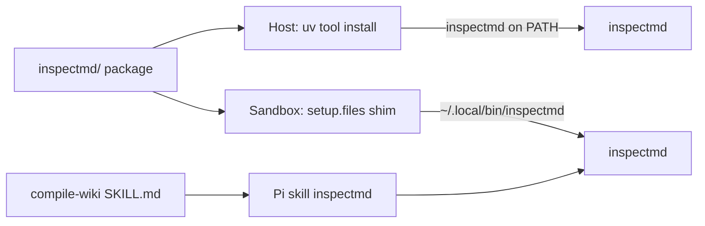

# Add `inspectmd` CLI + sandbox skill

## Context after the pyproject split

There is **no root** `pyproject.toml`. [`pdf2md/`](../pdf2md/) and [`web2md/`](../web2md/) are independent uv projects with zero shared config. [`Makefile`](../Makefile) already:

- runs ruff via pinned `uv tool run ruff@0.16.2` once per tracked `*/pyproject.toml`
- runs yamllint the same way (belongs to no project)

`inspectmd/` is a **third** independent project on that same pattern: own `pyproject.toml`, own `uv.lock`, own `[tool.ruff]`, own pytest config. No overlap with web2md or pdf2md.

## Why the prior plan fell short

[`.claude/plans/inspectmd.md`](../.claude/plans/inspectmd.md) got the *job* right (heading map so Pi can plan ranged reads/writes) but missed the delivery you asked for:

- Entry point was `./scripts/inspect-md.sh`, not a simple `inspectmd` command
- Explicitly avoided kit install and a skill; you want PATH + agent skill
- Mirrored `web2md/`’s “run by path, no package” shape instead of using uv the way the sandbox already installs Python CLIs (`uv tool install`)

## What it does

One Markdown file in → a heading tree with 1-based line ranges, char sizes, kebab-case slugs (matching [`pi/files/home/.pi/agent/AGENTS.md`](../pi/files/home/.pi/agent/AGENTS.md)). That replaces guessing seams before bounded reads/writes (see compile-wiki “Write in bounded chunks”).

```text
inspectmd md/GoogleStyleGuide.md
inspectmd --max-depth 2 md/TheRestIsHistory.md
inspectmd --section 3 md/GoogleStyleGuide.md   # one range for a ranged read
```

Exit codes: `0` ok, `2` usage/runtime (missing file, bad `--section`). Stdlib-only runtime; ATX headings only; skip fenced blocks and YAML frontmatter; preamble as section 0. No `--json`.

## Architecture



Source of truth is `inspectmd/` in the workspace. Host gets a real `uv tool install`. Sandbox cannot install from the workspace during `setup.install` (workspace not ready yet), so use `${WORKDIR}` via `setup.files` to write an executable shim under `~/.local/bin/`.

## Package layout

Third independent uv project (installable CLI, unlike path-run `web2md/`):

```text
inspectmd/
  pyproject.toml          # hatchling; scripts; test group; [tool.ruff]; pytest
  uv.lock                 # committed
  README.md
  src/inspectmd/
    __init__.py
    __main__.py           # python -m inspectmd
    cli.py                # argparse + format_table + main
    parse.py              # Section dataclass, frontmatter, ATX parse, slugify
  tests/
    test_parse.py
    test_cli.py
```

[`inspectmd/pyproject.toml`](../inspectmd/pyproject.toml) essentials:

- `requires-python = ">=3.12"`, no runtime deps
- `[build-system]` + hatchling (needed for `uv tool install` / console script)
- `[project.scripts] inspectmd = "inspectmd.cli:main"`
- `[dependency-groups] test = ["pytest>=8.4"]`
- `[tool.pytest.ini_options]`: `testpaths = ["tests"]`, `pythonpath` as needed for the src layout
- **`[tool.ruff]` owned here** — copy the same rule set web2md uses today (`target-version`, `line-length`, `select`, google pydocstyle, `"tests/*"` per-file-ignores). Do **not** share or import web2md’s config; duplication is intentional under the zero-overlap rule.

`uv lock --project inspectmd` → commit `inspectmd/uv.lock`.

## Delivery: three audiences

### 1. Host — real `inspectmd` on PATH

```bash
make install-inspectmd   # → uv tool install --force ./inspectmd
inspectmd md/foo.md
```

Optional without install: `uvx --from ./inspectmd inspectmd md/foo.md`. Document both in [`inspectmd/README.md`](../inspectmd/README.md) and root [`README.md`](../README.md) / [`AGENTS.md`](../AGENTS.md).

### 2. Sandbox — same command name on PATH

In [`pi/spec.yaml`](../pi/spec.yaml):

```yaml
setup:
  files:
    - path: /home/agent/.local/bin/inspectmd
      mode: "0755"
      description: Workspace-backed inspectmd CLI
      content: |
        #!/bin/sh
        set -eu
        exec uvx --from "${WORKDIR}/inspectmd" inspectmd "$@"
```

Add `inspectmd` to `agentInstructions` “Installed tools” (alongside `ruff` / `okf-lint`). Shim always tracks the mounted workspace — no stale kit copy of the Python sources.

### 3. Agent — dedicated Pi skill

New skill (helper procedure, not a second “task” that replaces compile-wiki):

```text
pi/files/home/.pi/agent/skills/inspectmd/
  SKILL.md
```

`SKILL.md` covers: when to run it (before ranged reads / before cutting page boundaries), the exact command, how to read the table, `--section` / `--max-depth`, exit codes, and that output is a plan not permission to paraphrase.

Wire it in:

- [`pi/files/home/.pi/agent/AGENTS.md`](../pi/files/home/.pi/agent/AGENTS.md) — list `inspectmd` under available skills
- [`pi/files/home/.pi/agent/skills/compile-wiki/SKILL.md`](../pi/files/home/.pi/agent/skills/compile-wiki/SKILL.md) — in “Write in bounded chunks” and procedure step 2: run `inspectmd` (or load the inspectmd skill) first and cut on reported ranges

No skill-owned Python copy: the CLI is the interface; the skill is the procedure.

## Tests, lint, and CI

- [`Makefile`](../Makefile):
  - `test-inspectmd` → `uv run --project inspectmd --group test pytest -c inspectmd/pyproject.toml` (same `-c` pattern as `PYTEST` for web2md)
  - `install-inspectmd` → `uv tool install --force ./inspectmd`
  - fold `test-inspectmd` into `test:`; update `.PHONY`
  - **no Makefile change for ruff** — once `inspectmd/pyproject.toml` is tracked, `git ls-files -- '*/pyproject.toml' | … | xargs $(RUFF) check` already includes it
- [`.github/workflows/ci.yml`](../.github/workflows/ci.yml): add a `test-inspectmd` job (mirror `test-web2md`) running `make test-inspectmd`
- [`tests/test-sandbox-guest.sh`](../tests/test-sandbox-guest.sh): `check inspectmd` and `check_file` the skill `SKILL.md`
- [`.coderabbit.yaml`](../.coderabbit.yaml): today `ruff.config_file` points at `web2md/pyproject.toml` only. Either leave it (CodeRabbit stays web2md-scoped) or note in the PR that multi-project ruff review is limited — do not invent a root config to “fix” that

Parser/CLI tests (offline): ATX rules, fence ignoring, frontmatter, preamble, empty file, slugify, `main()` success + exit 2.

## Docs touchpoints

- Root [`AGENTS.md`](../AGENTS.md) repository map + commands (`inspectmd/` as third independent Python project, `make test-inspectmd`, `make install-inspectmd`)
- Root [`README.md`](../README.md) — short “inspectmd” mention under Development
- Spell-check: any new words in skill/AGENTS prose via existing cspell path

## Verification

```bash
uv lock --project inspectmd
make lint                    # must ruff-check inspectmd/ via auto-discovery
make test-inspectmd
make test-web2md
make validate                # required: pi/ changes
make install-inspectmd && inspectmd md/GoogleStyleGuide.md
sbx rm --force md2okf && make test-sandbox
```

## Out of scope

`--json`, setext headings, publishing to PyPI, coverage against `okf/`, any third-party Markdown parser, and any return of a root `pyproject.toml`.
