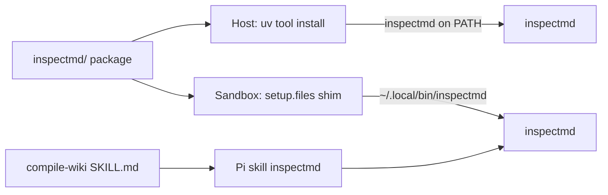

# Add `inspectmd` CLI + sandbox skill

## Why the prior plan fell short

[`.claude/plans/inspectmd.md`](../.claude/plans/inspectmd.md) got the *job* right (heading map so Pi can plan ranged reads/writes) but missed the delivery you asked for:

- Entry point was `./scripts/inspect-md.sh`, not a simple `inspectmd` command
- Explicitly avoided kit install and a skill; you want PATH + agent skill
- Mirrored `web2md/`’s “run by path, no package” shape instead of using uv the way the sandbox already installs Python CLIs (`uv tool install`)

## What it does

One Markdown file in → a heading tree with 1-based line ranges, char sizes, kebab-case slugs (matching [`pi/files/home/.pi/agent/AGENTS.md`](../pi/files/home/.pi/agent/AGENTS.md)). That replaces guessing seams before bounded reads/writes (see compile-wiki “Write in bounded chunks”).

```text
inspectmd md/GoogleStyleGuide.md
inspectmd --max-depth 2 md/TheRestIsHistory.md
inspectmd --section 3 md/GoogleStyleGuide.md   # one range for a ranged read
```

Exit codes: `0` ok, `2` usage/runtime (missing file, bad `--section`). Stdlib-only runtime; ATX headings only; skip fenced blocks and YAML frontmatter; preamble as section 0. No `--json`.

## Architecture



Single source of truth at repo root. Host gets a real uv tool install. Sandbox cannot `uv tool install` from the workspace during `setup.install` (workspace is not ready yet — kit apply order), so use the documented `${WORKDIR}` pattern: write an executable shim under `~/.local/bin/` via `setup.files`.

## Package layout

New uv project (not another path-run module like `web2md/`):

```text
inspectmd/
  pyproject.toml          # hatchling; [project.scripts] inspectmd = "inspectmd.cli:main"
  README.md
  src/inspectmd/
    __init__.py
    __main__.py           # python -m inspectmd
    cli.py                # argparse + format_table + main
    parse.py              # Section dataclass, frontmatter, ATX parse, slugify
  tests/
    test_parse.py
    test_cli.py
```

[`inspectmd/pyproject.toml`](../inspectmd/pyproject.toml) essentials:

- `requires-python = ">=3.12"`, no runtime deps
- `[dependency-groups] test = ["pytest>=8.4"]`
- `[project.scripts] inspectmd = "inspectmd.cli:main"`
- Build backend so `uv tool install ./inspectmd` and `uvx --from ./inspectmd` work

Keep root [`pyproject.toml`](../pyproject.toml) as the ruff config for the whole tree (add `"inspectmd/tests/*"` to per-file-ignores). Do not add a root `[build-system]` — leave `web2md`’s run-by-path story alone.

## Delivery: three audiences

### 1. Host — real `inspectmd` on PATH

```bash
make install-inspectmd   # → uv tool install --force ./inspectmd
inspectmd md/foo.md
```

Optional without install: `uvx --from ./inspectmd inspectmd md/foo.md`. Document both in [`inspectmd/README.md`](../inspectmd/README.md) and root [`README.md`](../README.md) / [`AGENTS.md`](../AGENTS.md).

### 2. Sandbox — same command name on PATH

In [`pi/spec.yaml`](../pi/spec.yaml):

```yaml
setup:
  files:
    - path: /home/agent/.local/bin/inspectmd
      mode: "0755"
      description: Workspace-backed inspectmd CLI
      content: |
        #!/bin/sh
        set -eu
        exec uvx --from "${WORKDIR}/inspectmd" inspectmd "$@"
```

Add `inspectmd` to `agentInstructions` “Installed tools” (alongside `ruff` / `okf-lint`). Shim always tracks the mounted workspace — no stale kit copy of the Python sources.

### 3. Agent — dedicated Pi skill

New skill (helper procedure, not a second “task” that replaces compile-wiki):

```text
pi/files/home/.pi/agent/skills/inspectmd/
  SKILL.md
```

`SKILL.md` covers: when to run it (before ranged reads / before cutting page boundaries), the exact command, how to read the table, `--section` / `--max-depth`, exit codes, and that output is a plan not permission to paraphrase.

Wire it in:

- [`pi/files/home/.pi/agent/AGENTS.md`](../pi/files/home/.pi/agent/AGENTS.md) — list `inspectmd` under available skills
- [`pi/files/home/.pi/agent/skills/compile-wiki/SKILL.md`](../pi/files/home/.pi/agent/skills/compile-wiki/SKILL.md) — in “Write in bounded chunks” and procedure step 2: run `inspectmd` (or load the inspectmd skill) first and cut on reported ranges

No skill-owned Python copy (unlike a temptation to mirror `lint-okf.sh`): the CLI is the interface; the skill is the procedure.

## Tests and CI

- [`Makefile`](../Makefile): `test-inspectmd` → `uv run --project inspectmd --group test pytest`; fold into `test:`; `.PHONY` update; `install-inspectmd` target
- Narrow `test-web2md` so it stays path-scoped once pytest config grows (same split the old plan wanted): `$(PYTEST) web2md/tests`
- [`.github/workflows/ci.yml`](../.github/workflows/ci.yml): add a `test-inspectmd` step (or sibling job) using `uv run --project inspectmd --group test pytest`
- [`tests/test-sandbox-guest.sh`](../tests/test-sandbox-guest.sh): `check inspectmd` and `check_file` the skill `SKILL.md` (same contract as other PATH tools + skill layout)

Parser/CLI tests (offline): ATX rules, fence ignoring, frontmatter, preamble, empty file, slugify, `main()` success + exit 2.

## Docs touchpoints

- Root [`AGENTS.md`](../AGENTS.md) repository map + commands (`inspectmd/`, `make test-inspectmd`, `make install-inspectmd`)
- Root [`README.md`](../README.md) — short “inspectmd” mention under Development
- Spell-check: any new words in skill/AGENTS prose via existing cspell path

## Verification

```bash
make lint
make test-inspectmd
make test-web2md
make validate                          # required: pi/ + possibly scripts/
make install-inspectmd && inspectmd md/GoogleStyleGuide.md
sbx rm --force md2okf && make test-sandbox   # fresh kit: shim + skill + agentInstructions
```

## Out of scope

`--json`, setext headings, publishing to PyPI, coverage against `okf/`, and any third-party Markdown parser.
