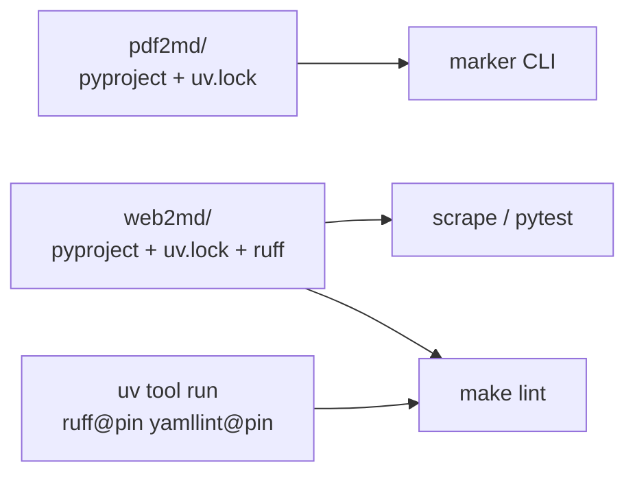

# Split pyproject.toml — zero overlap

## Goal

Today one root [`pyproject.toml`](../pyproject.toml) + [`uv.lock`](../uv.lock) mix unrelated concerns: heavy `marker-pdf` for the manual pdf step, the `web2md` scraper, and repo-wide `ruff`/`yamllint`. CI uses `--only-group` so lint/test never pull torch.

**End state:** two independent uv projects, **no root Python project**, **no shared config**.

| Project | Owns | Does not own |
| --- | --- | --- |
| [`pdf2md/`](../pdf2md/) | `marker-pdf`, `psutil`, own `uv.lock` | ruff, yamllint, pytest, scraper |
| [`web2md/`](../web2md/) | scraper deps, pytest, `[tool.ruff]`, own `uv.lock` | marker, yamllint |
| Repo root | nothing Python | no `pyproject.toml`, no `uv.lock` |

`ruff` and `yamllint` are **not** project dependencies. `make lint` runs them with pinned `uv tool run` (same idea as the sandbox’s `uv tool install ruff@…`).

Empty placeholders already exist at `pdf2md/pyproject.toml` and `web2md/pyproject.toml` — fill them.

## Design



- **Delete** root `pyproject.toml` and root `uv.lock`.
- **No uv workspace.** Separate venvs and lockfiles on purpose.
- **`[tool.ruff]` lives only in `web2md/pyproject.toml`** (the only first-party Python today). `pdf2md` has no `.py` files → no ruff block.
- **`make lint` runs ruff once per tracked subproject:**

  ```bash
  git ls-files -- '*/pyproject.toml' | xargs -n1 dirname | xargs $(RUFF) check
  ```

  Today that is just `web2md`. A future `inspectmd/pyproject.toml` is picked up automatically; that project carries its **own** `[tool.ruff]` — no shared config.
- **yamllint** stays repo-wide (YAML lives outside the Python projects) via `uv tool run`, not via any `pyproject.toml`.
- **Pins** match the sandbox ([`pi/spec.yaml`](../pi/spec.yaml)): `ruff@0.16.2`, `yamllint@1.38.0`.
- **Invocations:** `uv run --project <dir> …` from the repo root (keeps `pdf/` / `md/` relative paths working for marker). For pytest, pair with `-c web2md/pyproject.toml` so `testpaths` / `pythonpath` resolve (verified need in the Claude plan), **or** use `--directory web2md` if that proves cleaner when implementing — either way, config is web2md-local only.

## Files

### Create / fill `pdf2md/pyproject.toml`

```toml
[project]
name = "pdf2md"
version = "0.1.0"
description = "Convert a PDF into Markdown with marker"
requires-python = ">=3.12"
dependencies = ["marker-pdf>=1.10.2", "psutil>=7.2.2"]

# No [build-system]: pins marker for `uv run --project pdf2md marker ...` only.
```

`uv lock --project pdf2md` → commit `pdf2md/uv.lock`.

### Create / fill `web2md/pyproject.toml`

- `[project].dependencies` = today’s `web2md` group (`httpx`, `beautifulsoup4`, `lxml`, `markdownify`)
- `[dependency-groups] test = ["pytest>=8.4"]`
- `[tool.pytest.ini_options]`: `testpaths = ["tests"]`, `pythonpath = ["src"]`
- Full `[tool.ruff]` moved from today’s root (change per-file-ignores to `"tests/*"`)
- No `[build-system]` (still run-by-path)

`uv lock --project web2md` → commit `web2md/uv.lock`.

### Delete

- `/pyproject.toml`
- `/uv.lock`

### Makefile

```make
RUFF ?= uv tool run ruff@0.16.2
YAMLLINT ?= uv tool run yamllint@1.38.0
PYTEST ?= uv run --project web2md --group test pytest -c web2md/pyproject.toml

lint:
	# ... existing md/json/yaml/shell/cspell ...
	git ls-files -- '*/pyproject.toml' | xargs -n1 dirname | xargs $(RUFF) check

test-web2md:
	$(PYTEST)

scrape:
	uv run --project web2md python web2md/src/web2md.py
```

Rewrite the top-of-file tool-override comments: no more root `dev` group; CI needs no `RUFF`/`YAMLLINT`/`PYTEST` overrides for “avoid marker”.

### CI ([`.github/workflows/ci.yml`](../.github/workflows/ci.yml))

- Lint job: drop `YAMLLINT=` / `RUFF=` overrides (Makefile pins are enough). Keep `MARKDOWNLINT='npx --yes markdownlint-cli2'`.
- `test-web2md`: plain `make test-web2md`.
- Keep `astral-sh/setup-uv`.

### Docs

- [`AGENTS.md`](../AGENTS.md), [`README.md`](../README.md), [`pdf2md/README.md`](../pdf2md/README.md), [`web2md/README.md`](../web2md/README.md): two independent projects; root has no Python project; lint tools via `uv tool run`.
- [`.coderabbit.yaml`](../.coderabbit.yaml): `ruff.config_file: "web2md/pyproject.toml"`.

`.gitignore` / `.python-version`: unchanged (unanchored `.venv/` already covers subprojects).

## Verification

```bash
uv lock --project pdf2md
uv lock --project web2md
# root pyproject.toml and uv.lock are gone
make lint
make test-web2md
make scrape   # or path sanity-check
uv run --project pdf2md marker --help
```

No `pi/` / `scripts/` edits → `make validate` not required for this change alone.

## Relation to inspectmd

[`inspectmd`](inspectmd.md) becomes a third independent project under `inspectmd/` with its **own** `[tool.ruff]` and `uv.lock`. Do **not** assume a root ruff config. Update that plan when implementing inspectmd (drop “keep root pyproject for ruff”).

## Explicitly not doing

- Any root `pyproject.toml` (thin or otherwise)
- Shared ruff/yamllint config between projects
- A uv workspace
- Putting ruff or yamllint into either project’s dependencies
