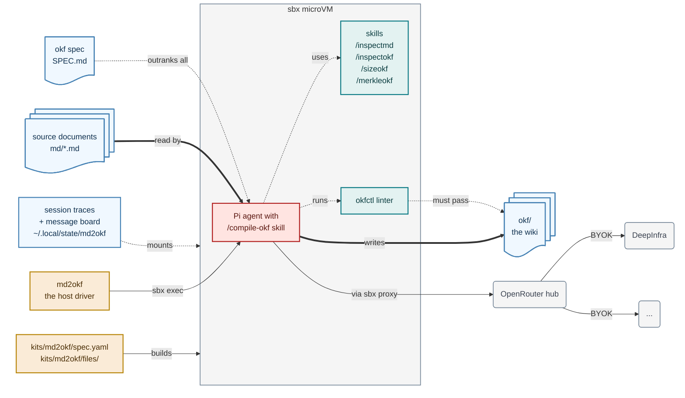

# md2okf

[](https://github.com/lars20070/md2okf/actions/workflows/ci.yml)
[](https://github.com/lars20070/md2okf/releases/latest)
[](LICENSE)

Compile Markdown documents into an OKF knowledge base with a coding agent.

Point `md2okf` at a Markdown file or folder and the [Pi coding
agent](https://pi.dev) writes a wiki into the output directory: a page per
topic, an index in every directory, links between them, and a log of what each
run changed. OKF,
the [Open Knowledge
Format](https://github.com/GoogleCloudPlatform/knowledge-catalog/tree/main/okf),
is a tree of Markdown files with YAML frontmatter and nothing else — no schema
registry, no server, nothing to install. The agent takes one source document per
run and folds it into the wiki already on disk, so documents accumulate rather
than overwrite. [SPEC.md](SPEC.md) is the OKF specification the wiki is built
against; the agent reads it at the start of every run, and it outranks any
other instructions.

<!-- cspell:disable -->



<br>*Host tooling (amber) builds the microVM from the kit and drives it with one
`sbx exec` per source document. Inside, the Pi agent (red) runs the
`/compile-okf` skill: it reads the source documents and `SPEC.md` (blue) and writes the wiki into `okf/` (blue), the
only content it may change. Skills and the linter (teal) support it — the four
tools survey the source markdown and wiki, and the linter must pass before a run ends. Session
state (blue) is mounted from the host, so transcripts outlive the sandbox.
Model calls leave the VM only through the sbx proxy, which injects the
OpenRouter key; OpenRouter routes them to DeepInfra or other providers (gray).*

<!-- cspell:enable -->

## Contents

- [Requirements](#requirements)
- [Quickstart](#quickstart)
- [Session state](#session-state)
- [How it works](#how-it-works)
- [What lands in okf/](#what-lands-in-okf)
- [Getting Markdown in](#getting-markdown-in)
- [Set up the OpenRouter key](#set-up-the-openrouter-key)
- [Troubleshooting](#troubleshooting)
- [Development](#development)
- [Getting help](#getting-help)
- [License](#license)

## Requirements

- macOS with [Homebrew](https://brew.sh), or
  Linux with [KVM](https://en.wikipedia.org/wiki/Kernel-based_Virtual_Machine). Docker Desktop is not
  required.
- [sbx](https://github.com/docker/sbx-releases) 0.43.0 is required. sbx is experimental. A later version may break `md2okf`.
- An [OpenRouter](https://openrouter.ai) API key, which pays for the model the
  agent runs on.
- [uv](https://docs.astral.sh/uv/), which installs and runs `md2okf`.
- `git`. `make` and `jq` are needed only for the developer tasks in
  [the contributing guide](CONTRIBUTING.md), not for compiling.
- [okfctl](https://github.com/cwest/okfctl), only for the host-side `make
  check-okf`: `brew install cwest/tap/okfctl`. The sandbox installs its own
  pinned copy, so a compile does not need it.

## Quickstart

Install the sandbox CLI and sign in.

[macOS:](https://docs.docker.com/ai/sandboxes/install/#install-on-macos)

```bash
brew trust docker/tap
brew install docker/tap/sbx
sbx login
```

[Linux:](https://docs.docker.com/ai/sandboxes/install/#linux)

```bash
curl -fsSL https://get.docker.com | sudo REPO_ONLY=1 sh
sudo apt-get install docker-sbx
sudo usermod -aG kvm "$USER" && newgrp kvm
sbx login
```

Hand sbx your OpenRouter key once — see [Set up the OpenRouter
key](#set-up-the-openrouter-key). Then install the command and compile:

```bash
uv tool install .                       # from a clone
md2okf my-document.md                   # the wiki lands in ./okf
```

`uv tool install git+https://github.com/lars20070/md2okf` installs it without a
clone. The command takes files or folders, and `-o` chooses the output:

```bash
md2okf -o wikis/handbook docs/handbook/   # every *.md in that folder
md2okf -n 20 long-document.md             # raise the iteration cap
md2okf --dry-run md/                      # resolve and print, run nothing
```

Session state defaults to `~/.local/state/md2okf`; export `XDG_STATE_HOME` to
put it elsewhere. Changing it once a sandbox exists takes one manual step — see
[Session state](#session-state).

Each document gets its own agent run, and each run reports the wiki's root hash
before and after (tool calls and agent prose stream in between):

```text
Compiling document md/my-document.md (iteration 1)
7f3c1a9d4e02 -> b481d05c6a17
Compiling document md/my-document.md (iteration 2)
b481d05c6a17 -> b481d05c6a17
```

`-o` defaults to `./okf`, which this repository gitignores, so generated pages
stay out of the repo. `md/` is tracked and ships with sample documents, so
`md2okf md/` has something to compile straight away. `md2okf` manages its
output directory: it creates one that does not exist, adopts one that is empty
or already an OKF bundle root, and refuses anything else rather than deleting
what it finds.

## Session state

Pi writes transcripts through its native `~/.pi/agent/sessions` path. Inside
the sandbox that directory is bind-mounted onto the host's
`$XDG_STATE_HOME/md2okf/sessions`, so sessions survive `sbx rm` and retain Pi's
native per-working-directory layout. All md2okf clones using the same state
home intentionally share this directory; Pi's own layout separates their
working directories.

State location follows this precedence: an exported absolute `XDG_STATE_HOME`,
then `~/.local/state`. XDG requires an absolute path, so a relative value counts
as unset. Paths containing spaces are supported.

The state location and the mounts are fixed when a sandbox is created. `md2okf`
records what it built — the sandbox's identity and the configuration
fingerprint — *under that state root*, and reuses the sandbox only when the
recorded identity, the fingerprint and a cheap in-VM probe all agree. Edit the
kit, or change anything else the fingerprint covers, and the next run rebuilds
by itself.

Changing `XDG_STATE_HOME` is the exception, because it moves the record out of
view: the new state root has no marker, so a sandbox still named `md2okf`
cannot be proved to be ours. `md2okf` stops with exit 2 rather than deleting
something it may not own, and `--fresh` does not override that — it recreates a
sandbox we *can* prove is ours. Run `sbx rm --force md2okf` yourself, then use
the new state home.

## How it works

`md2okf` runs on the host and drives the agent inside a microVM, repeatedly,
until a hash of the output stops moving. The host drives; everything else
happens inside the sandbox.

One sandbox named `md2okf` serves every run. Rather than mounting your folders
— sbx fixes a sandbox's mounts when it is created, so a second `-o` would mean
either a rebuild or writing into the first wiki — the command stages each run
through a fixed workbench under `$XDG_STATE_HOME/md2okf/work`: your inputs are
copied in, the target wiki is mirrored in before the run and back out after
every iteration, and the mount paths never change. The sandbox is rebuilt only
when the kit it was built from changes, when the configuration no longer
matches, or on `--fresh`.

It runs the agent once per document, re-running the same document (a *Ralph
loop*) until `merkleokf --nolog -L 0` reports an unchanged wiki root hash.
`merkleokf` prints a Merkle hash tree, one hash per file and per directory, so a
change to any page moves the root hash and an unchanged root means the run added
nothing — which on a first pass is the idempotent re-run, not a failure. The
loop is capped by `-n` (default 10). The agent's only writable content output is
`okf/`, the [okfctl](https://github.com/cwest/okfctl) check must pass before it
finishes, and `SPEC.md` outranks every instruction file. Each run streams
tool names and assistant text as it goes, and Pi writes its session transcript
through its native session path into persistent host state.

### What the sandbox can reach

The sandbox does not get the repository, and it does not get your folders
either. It gets five named mounts, all of them inside the workbench, and
nothing else of yours is visible inside the microVM — not `.git`, not the
`Makefile`, not the kit that built it:

| Mount | Access | Why |
| --- | --- | --- |
| `work/okf` | read-write | the wiki, and the agent's working directory |
| `work/md` | read-only | the staged source documents, read as data and never modified |
| `work/scripts` | read-only | the four helper CLI projects the agent runs |
| `work/SPEC.md` | read-only | the specification that outranks every instruction |
| `$XDG_STATE_HOME/md2okf/sessions` | read-write | persistent Pi session state |

Every one of them is under `$XDG_STATE_HOME/md2okf`, so the agent never sees a
path of yours: it works on the staged copies, and the driver mirrors the wiki
back out. The state *root* is deliberately not mounted — it also holds the
host-side ownership marker — and no read-write mount is an ancestor of a
read-only one, so `work/md` and `work/SPEC.md` stay read-only even against root
in the guest. The mount list lives in one place,
[`src/md2okf/workbench.py`](src/md2okf/workbench.py); `sbx inspect md2okf` shows
what a running sandbox actually got. Because `work/okf` is the primary mount it
is also the working directory inside the VM, which is why the agent addresses
its siblings as `../md/`, `../scripts/` and `../SPEC.md`.

### Repository layout

| Path | Description |
| --- | --- |
| `md/` | source documents, one agent run each |
| `okf/` | the generated wiki, `-o`'s default |
| `src/md2okf/` | the `md2okf` command: workbench, sbx seam, Ralph loop |
| `Makefile` | the developer tasks — lint, validate, tests, installs |
| `scripts/` | the four helper CLIs the agent runs (`inspectmd`, `inspectokf`, `sizeokf`, `merkleokf`), plus repository chores |
| `kits/md2okf/` | what the driver runs: the Docker Sandbox kit and the config it carries |
| `SPEC.md` | the [OKF specification](https://github.com/GoogleCloudPlatform/knowledge-catalog/blob/main/okf/SPEC.md) the wiki is built against |
| `AGENTS.md` | instructions for coding agents working *on this repo*, not for Pi |
| `pdf2md/` | optional: converts a PDF into `md` |
| `web2md/` | optional: scrapes a documentation site into `md` |

## What lands in okf/

```text
okf/
├── index.md          # root index, the only one carrying frontmatter
├── log.md            # what each run changed, newest first
├── <page>.md         # a content page at the wiki root
└── <topic>/          # one directory per topic, nested as deep as it needs
    ├── index.md      # a plain link list for this directory
    └── <page>.md     # a content page within the topic
```

Content pages carry `type`, `title`, `description` and `tags` in their
frontmatter. Slugs are kebab-case. Links are bundle-absolute, so
`/glossary/verb.md` rather than `glossary/verb.md`. The root `index.md` names
the spec version the agent reads. Pages are updated in place, not duplicated, so
compiling the same document twice is safe.

## Getting Markdown in

`md/` wants clean, structured Markdown, and a source document is rarely that.
Two helpers produce it. Both are optional, and neither is part of a compile.

**From a PDF.** `marker` converts one with the help of a language model, either
a local Ollama model or a cloud model through OpenRouter. Expect to check the
output, and run the step by hand — see
[the pdf2md guide](pdf2md/README.md).

**From a website.** `make scrape` walks a documentation site and writes one
Markdown document into `md/`. No model is involved, so the result is
deterministic, and the fetched HTML is cached — see
[the web2md guide](web2md/README.md).

## Set up the OpenRouter key

`sbx` keeps the key out of the virtual machine. It holds the real string on the
host and swaps it into requests at its proxy, so inside the sandbox
`$OPENROUTER_API_KEY` reads `proxy-managed`. Set it twice:

```bash
export OPENROUTER_API_KEY=sk-or-...
echo "$OPENROUTER_API_KEY" | sbx secret set openrouter

# And again as a custom secret, to work around a known sbx issue:
# https://github.com/docker/sbx-releases/issues/25
sbx secret set-custom --sandbox md2okf \
  --host openrouter.ai \
  --env OPENROUTER_API_KEY \
  --value "$OPENROUTER_API_KEY"
```

`md2okf` is the kit's name, which comes from `kits/md2okf/spec.yaml`. The
command reads the key from `sbx secret`, never from your shell environment, and
refuses to start if it is not proxy-managed. To point the
agent at a different provider, see [the kit guide](kits/md2okf/README.md).

## Troubleshooting

**`sbx` reports unknown fields from `kits/md2okf/spec.yaml`.** Your sbx is older
than 0.43.0 and does not know the kit-spec v2 grammar. Run `brew upgrade sbx`.

**A runtime command fails to authenticate.** `md2okf` and `make test-sandbox`
need an active `sbx login` session.

**`hit 10 iterations without converging`.** The wiki root hash kept changing.
Raise the cap for one run with `md2okf -n 20 …`, or inspect
`$XDG_STATE_HOME/md2okf/sessions` to see what the agent was doing (by default,
`~/.local/state/md2okf/sessions`).

**`a sandbox called 'md2okf' exists but is not recognisably ours`.** Most often
you changed `XDG_STATE_HOME` since the sandbox was built, so the ownership
record it left behind is under the old state root. It can also mean something
else created it — an older release, or a manual `sbx run`. Either way `md2okf`
will not delete a sandbox it cannot prove it owns, and `--fresh` will not either:
run `sbx rm --force md2okf` yourself and try again.

**Checking a wiki outside this repository.** The frontmatter guard reads the
spec as a sibling of the bundle, so `check-okf.sh /some/wiki` needs `SPEC_MD`
pointed at a copy of [`SPEC.md`](SPEC.md).

## Development

Lint, tests, the sandbox checks, the helper CLIs and the per-subproject layout
are covered in [the contributing guide](CONTRIBUTING.md). The short version:
`make lint` checks the source tree, `make validate` checks the sandbox kit spec,
and CI runs both on every pull request. `uv run md2okf` runs the command from a
clone without installing it, `make install` puts it on your PATH, and
`make install-clis` does the same for the four helper CLIs.

## Getting help

Questions, bugs and feature requests belong in [the issue
tracker](https://github.com/lars20070/md2okf/issues).

## License

Released under the [MIT License](LICENSE).
