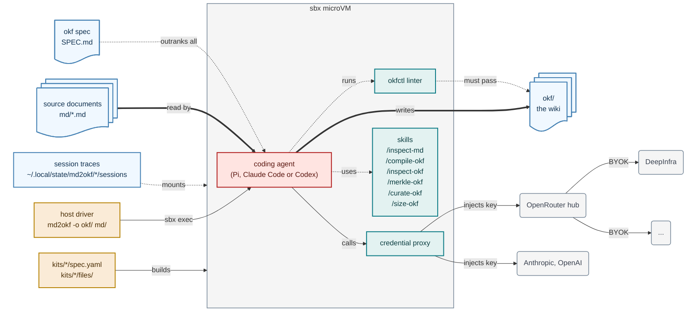

# md2okf

[](https://github.com/lars20070/md2okf/actions/workflows/ci.yml)
[](https://github.com/lars20070/md2okf/releases/latest)
[](https://github.com/lars20070/md2okf/blob/master/LICENSE)

Compile Markdown documents into an OKF knowledge base with a coding agent.

Point `md2okf` at a Markdown file or folder and a coding agent writes a wiki into the output
directory: a page per topic, an index in every directory, links between them,
and a log of what each run changed. OKF,
the [Open Knowledge
Format](https://github.com/GoogleCloudPlatform/open-knowledge-format) by Google,
is a tree of Markdown files with YAML frontmatter and nothing else — no schema
registry, no server, nothing to install. The agent takes one source document per
run and folds it into the wiki already on disk, so documents accumulate rather
than overwrite. [SPEC.md](SPEC.md) is the OKF specification the wiki is built
against; the agent reads it at the start of every run, and it outranks any
other instructions.

<!-- cspell:disable -->


```mermaid
---
config:
  flowchart:
    nodeSpacing: 35
    rankSpacing: 45
---
flowchart LR
  subgraph IN[" "]
    direction TB
    SPEC@{ shape: doc, label: "okf spec<br>SPEC.md"}
    MD@{ shape: docs, label: "source documents<br>md/*.md"}
    STATE["session traces<br/>~/.local/state/md2okf/*/sessions"]
    DRV["host driver<br>md2okf -o okf/ md/"]
    KIT["kits/*/spec.yaml<br/>kits/*/files/"]
  end

  subgraph VM["sbx microVM"]
    AGENT["coding agent<br/>(Pi, Claude Code or Codex)"]
    LINT["okfctl linter"]
    TOOLS["skills<br>/inspect-md<br/>/compile-okf<br/>/inspect-okf<br/>/merkle-okf<br/>/curate-okf<br/>/size-okf"]
    PROXY["credential proxy"]
  end

  subgraph OUT[" "]
    direction TB
    OKF@{ shape: docs, label: "okf/<br/>the wiki"}
    NET("OpenRouter hub")
    NET3("Anthropic, OpenAI")
  end
  NET1("DeepInfra")
  NET2("...")

  SPEC -.->|"outranks all"| AGENT
  MD ==>|"read by"| AGENT
  STATE -.->|"mounts"| VM
  STATE ~~~ AGENT
  DRV -->|"sbx exec"| AGENT
  KIT -->|"builds"| VM
  AGENT -.->|"runs"| LINT
  LINT -.->|"must pass"| OKF
  AGENT ==>|"writes"| OKF
  AGENT -.->|"uses"| TOOLS
  AGENT -->|"calls"| PROXY
  PROXY -->|"injects key"| NET
  PROXY -->|"injects key"| NET3
  NET -->|"BYOK"| NET1 & NET2

  classDef data    fill:aliceblue,stroke:steelblue,stroke-width:2px,color:#10314F
  classDef host    fill:antiquewhite,stroke:darkgoldenrod,stroke-width:2px,color:#4A2E05
  classDef helper  fill:#E3F2F1,stroke:#0E7C86,stroke-width:2px,color:#0B3D40
  classDef agent   fill:mistyrose,stroke:firebrick,stroke-width:2px,color:#5A1710
  classDef ext     fill:whitesmoke,stroke:lightslategray,stroke-width:1.5px,color:#3A4250
  class MD,SPEC,STATE,OKF data
  class KIT,DRV host
  class TOOLS,LINT,PROXY helper
  class AGENT agent
  class NET,NET3,NET1,NET2 ext
  style VM fill:whitesmoke,stroke:lightslategray,stroke-width:1.5px
  style IN fill:none,stroke:none
  style OUT fill:none,stroke:none
```

<br>*Host tooling (amber) builds the microVM from the kit and drives it with one
`sbx exec` per source document. Inside, the coding agent (red) runs the
`/compile-okf` skill: it reads the source documents and `SPEC.md` (blue) and writes the wiki into `okf/` (blue), the
only content it may change. Skills and the linter (teal) support it — four of
them survey the source markdown and wiki, `curate-okf` maintains its nodes and
indexes, and the linter must pass before a run ends. Session
state (blue) is mounted from the host, so transcripts outlive the sandbox.
Model calls leave the VM only through the sbx credential proxy (teal), which
injects the API key; OpenRouter routes them to DeepInfra or other providers (gray).*

<!-- cspell:enable -->

## Contents

- [Quickstart](#quickstart)
- [Install sbx](#install-sbx)
- [Set up the OpenRouter key](#set-up-the-openrouter-key)
- [Further documentation](#further-documentation)
- [License](#license)

## Quickstart

`md2okf` needs [`sbx`](#install-sbx), which runs the sandbox, and [`uv`](https://docs.astral.sh/uv/getting-started/installation), which installs the tool. Pi, the default agent, also needs an [OpenRouter API key](#set-up-the-openrouter-key).

```bash
uv tool install md2okf       # Install from PyPI
md2okf --version

md2okf -v my-document.md     # The wiki lands in ./okf
md2okf -v md/ -o okf/
```

`uv` installs the tool from [PyPI](https://pypi.org/project/md2okf/), so there is no need to clone the repository. Point `md2okf` at a single Markdown file or a folder of Markdown files, and it compiles them into an OKF wiki. The first run builds the sandbox; later runs reuse it. `-v` turns on verbose mode, which also shows the agent's tool calls and messages. Leave it out for a quieter run that prints only progress.

```bash
uvx md2okf -v my-document.md
uvx md2okf -v md/ -o okf/
```

Alternatively, skip the installation and run the tool directly with `uvx`.

```bash
md2okf --shell               # Interactive shell at the wiki root
md2okf --agent               # Interactive agent session
```

The first flag opens a shell inside the sandbox, at the wiki root; the second opens an interactive session with the agent. Both are for inspecting the sandbox. Changes made in either session stay in the sandbox's working copy: they are not copied to `okf/`, and the next compile replaces them.

## Install sbx

Install the `sbx` command-line tool and sign in.

[macOS:](https://docs.docker.com/ai/sandboxes/install/#install-on-macos)

```bash
brew trust docker/tap
brew install docker/tap/sbx
sbx login
```

[Linux:](https://docs.docker.com/ai/sandboxes/install/#linux)

```bash
curl -fsSL https://get.docker.com | sudo REPO_ONLY=1 sh
sudo apt-get install docker-sbx
sudo usermod -aG kvm "$USER" && newgrp kvm
sbx login
```

## Set up the OpenRouter key

`sbx` keeps the key out of the virtual machine. It holds the real key on the
host and swaps it into requests at its proxy, so inside the sandbox
`$OPENROUTER_API_KEY` reads `proxy-managed`. Store the key with `sbx` twice:

```bash
export OPENROUTER_API_KEY=sk-or-...
echo "$OPENROUTER_API_KEY" | sbx secret set openrouter

# And again as a custom secret, to work around a known sbx issue:
# https://github.com/docker/sbx-releases/issues/25
sbx secret set-custom --sandbox md2okf-pi \
  --host openrouter.ai \
  --env OPENROUTER_API_KEY \
  --value "$OPENROUTER_API_KEY"
```

`md2okf-pi` is the sandbox Pi runs in; each agent gets its own, called
`md2okf-<agent>`. The `export` only passes the key to the two `sbx` commands:
`md2okf` reads it from `sbx secret`, never from your shell environment.

## Further documentation

| Guide | Covers |
| --- | --- |
| [Usage](https://github.com/lars20070/md2okf/blob/master/docs/usage.md) | What you can compile, reading the output, the wiki's layout, every CLI flag and exit code |
| [Configuration](https://github.com/lars20070/md2okf/blob/master/docs/configuration.md) | Choosing an agent, credentials for Claude Code and Codex, models and providers |
| [Architecture](https://github.com/lars20070/md2okf/blob/master/docs/architecture.md) | The run loop, the sandbox's mounts, credentials, session state, the repository layout |
| [Contributing](https://github.com/lars20070/md2okf/blob/master/CONTRIBUTING.md) | Lint, tests, the helper CLIs, releasing |

## License

Released under the [MIT License](https://github.com/lars20070/md2okf/blob/master/LICENSE).
